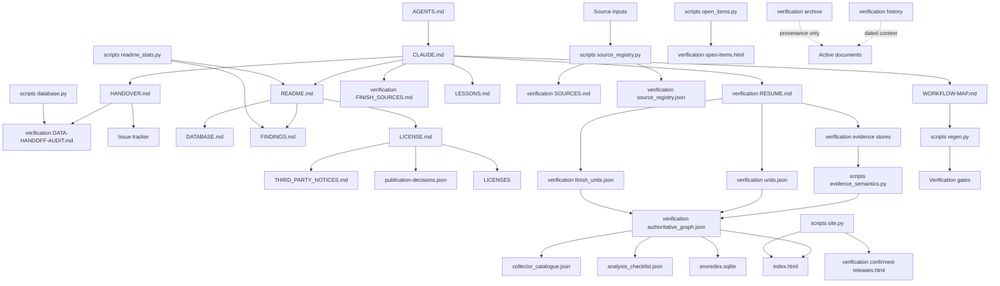

<!-- doc:
role=documentation audit and remediation ledger
stage=task
-->
# Documentation and comment audit

Audit date: 2026-08-29

Implementation updated: 2026-08-30

Scope: all tracked repository documentation, public explanatory surfaces, machine-readable contracts, generated reports, source comments, test comments, workflow comments, archived script comments, and the dependency paths between them.

This file is the audit, remediation plan, implementation record, and progress ledger. Audit findings remain written in their original context. The implementation status and change ledger record what was corrected after the audit.

## Progress

- [x] Read the canonical repository instructions and required handoff documents.
- [x] Classified all 6,667 tracked files by role and extension.
- [x] Read all 48 Markdown files individually.
- [x] Read the two public text files, three authored HTML surfaces, workflow files, issue templates, repository metadata, SQL contract, CSS, and JavaScript.
- [x] Reviewed all 71 JSON files outside retained provider runs by contract role and dependency position.
- [x] Reviewed the three CSV exports and three JSON Lines stores by producer and consumer.
- [x] Scanned comments and docstrings in all 134 Python files.
- [x] Scanned comments in all 67 archived PowerShell files.
- [x] Scanned comments in the four YAML files, CSS, JavaScript, SQL, Git metadata, and requirements file.
- [x] Built the documentation and data dependency graph.
- [x] Compared repeated policy statements and current-state claims.
- [x] Ran the documentation contract, findings review, and full regeneration gate.
- [x] Implemented remediation Phases 0 through 7.
- [x] Regenerated all offline artifacts that do not require a successful new provider response.
- [x] Ran the read-only generator checks twice without a worktree change.
- [x] Ran 122 browser checks successfully.
- [~] Phase 8 is blocked in the source-discovery lane by retained provider timeouts.

## Audit boundary and method

The tracked tree contains 4,976 JSON files, 888 HTML files, 300 JPG files, 234 PNG files, 134 Python files, 67 PowerShell files, 48 Markdown files, four YAML files, three CSV files, three JSON Lines files, two text files, two SQLite databases, one JPEG file, one SQL file, one JavaScript file, one CSS file, and repository metadata.

The 885 HTML files under retained provider runs and most JSON files under those runs are immutable source captures. They are evidence inputs, not repository-authored documentation. They were accounted for through their manifests, hashes, adapters, schemas, and integrity gates. The 535 image files and two SQLite files were treated as evidence or consumer artifacts. Their references and integrity contracts were checked, but they were not treated as authored prose.

The audit used four review classes:

| Class | Meaning |
|---|---|
| Active | Current instructions, policy, public copy, or executable contract |
| Generated | A projection whose source and regeneration path must be checked |
| History | A dated record that may remain stale when its snapshot banner is correct |
| Archive | Hash-pinned provenance that must not be edited to match current policy |

## Documentation dependency graph



The dashed edges must remain one-way context. History and archive files must not become authorities for current counts or current absence policy.

## Markdown file ledger

Every Markdown file is listed below. Result values identify the outcome of the individual read.

| File | Class | Result |
|---|---|---|
| `.agents/skills/snoredex-claim-evidence/SKILL.md` | Active | Aligned with positive evidence and scoped claim changes |
| `.agents/skills/snoredex-finish-refresh/SKILL.md` | Active | Aligned with versioned snapshot review |
| `.agents/skills/snoredex-issue-delivery/SKILL.md` | Active | Aligned with issue-scoped delivery and verification |
| `.agents/skills/snoredex-pr-remediation/SKILL.md` | Active | Aligned with exact-head remediation |
| `.agents/skills/snoredex-source-refresh/SKILL.md` | Active | Aligned with source-first discovery boundaries |
| `.agents/skills/snoredex-specimen-intake/SKILL.md` | Active | Aligned with physical evidence handling |
| `.agents/skills/snoredex-state-audit/SKILL.md` | Active | Used for this read-only audit |
| `.agents/skills/snoredex-ui-audit/SKILL.md` | Active | Aligned with generated UI review |
| `AGENTS.md` | Active | Correct pointer to the canonical instructions |
| `AI-DECLARATION.md` | Active | Aligned with the declared transparency level |
| `CLAUDE.md` | Active | Canonical policy and workflow authority |
| `CONTRIBUTING.md` | Active | Mostly aligned with evidence and correction flow |
| `DATABASE.md` | Active | Aligned with the SQLite contract and application views |
| `FINDINGS.md` | Active | Contains a wrong card number and treatment comparison |
| `HANDOVER.md` | Active | Correct routing document, but repeats mutable totals |
| `LESSONS.md` | Active | Appropriate home for incident rationale |
| `LICENSE.md` | Active | Contains stale publication status and an open decision that is settled |
| `LICENSES/CC-BY-NC-SA-4.0.md` | Legal source | Publisher text verified by the repository hash gate |
| `LICENSES/PolyForm-Noncommercial-1.0.0.md` | Legal source | Publisher text verified by the repository hash gate |
| `LICENSES/README.md` | Active | Correct source and hash handling instructions |
| `README.md` | Active and generated blocks | Prose is mostly aligned, but generated blocks fail the current freshness check |
| `THIRD_PARTY_NOTICES.md` | Active | Provider, specimen-rights, consent, and absence statements are stale |
| `WORKFLOW-MAP.md` | Active | Correct normative pipeline map |
| `verification/ADR-0001-locality-aware-print-identity.md` | Active reference | Accepted identity decision, aligned |
| `verification/ADR-0002-local-set-edition-release-events.md` | Active reference | Accepted local set model, aligned |
| `verification/ADR-0003-source-capability-coverage.md` | Active reference | Accepted scoped capability model, aligned |
| `verification/ADR-0004-source-first-adapter-runs.md` | Active reference | Accepted retained-run model, aligned |
| `verification/ADR-0005-legacy-set-reconciliation.md` | Active reference | Accepted reconciliation model, aligned |
| `verification/ADR-0006-source-first-card-discovery.md` | Active reference | Accepted discovery model, aligned |
| `verification/ADR-0007-embedded-artwork-review-ui.md` | Active reference | Accepted browser review boundary, aligned |
| `verification/ADR-0008-reviewed-catalogue-basis-lists.md` | Active reference | Accepted reviewed basis boundary, aligned |
| `verification/ASIA-LOCALITY-MATRIX.md` | Generated | Generator-owned locality projection |
| `verification/CATCHUP-SETS.md` | Active reference | Research plan with no verified current contradiction found |
| `verification/DATA-HANDOFF-AUDIT.md` | Generated | Current-state report, but its database input fails freshness checks |
| `verification/FINISH_SOURCES.md` | Active task | Finish-specific source model is aligned |
| `verification/LOCALITY-ERA-MATRIX.md` | Generated | Generator-owned era projection |
| `verification/RECURRENCE.md` | Active reference | Correct recurring workflow map |
| `verification/RESUME.md` | Active task | Internal scope contradiction, four broken code paths, and stale absence wording |
| `verification/SOURCES.md` | Generated | Generator emits overbroad absence wording and a stale specimen note |
| `verification/archive/passes/README.md` | Archive | Stale paths are expected inside the immutable archive |
| `verification/history/BULBAPEDIA-RELEASE-DATE-AUDIT.md` | History | Correct dated snapshot banner |
| `verification/history/LAUNCH-RUNBOOK.md` | History | Correct dated snapshot banner |
| `verification/history/POWERSHELL-MIGRATION-PLAN.md` | History | Correct dated snapshot banner |
| `verification/history/PUBLIC-READINESS-AUDIT.md` | History | Correct dated snapshot banner |
| `verification/history/REVIEW-2026-07-25.md` | History | Correct dated snapshot banner |
| `verification/history/REVIEW-2026-07-31-ISSUE-STATUS.md` | History | Correct dated snapshot banner |
| `verification/history/REVIEW-2026-08-28-OPEN-ISSUE-SPEC-AUDIT.md` | History | Correct dated snapshot banner |
| `verification/passes/README.md` | Active reference | Correct boundary for retained one-shot passes |

## Other explanatory surfaces

| File | Role | Result |
|---|---|---|
| `llms.txt` | Public machine-readable orientation | Aligned with scope and positive evidence policy |
| `requirements.txt` | Dependency note | Accurate and concise |
| `.gitignore` | Retention and generated-file rationale | Useful rationale, but several comments are longer than necessary |
| `.gitattributes` | Byte preservation policy | Necessary and aligned with archive and licence checks |
| `.github/ISSUE_TEMPLATE/config.yml` | Issue routing | Aligned |
| `.github/ISSUE_TEMPLATE/printing-correction.yml` | Evidence intake UI | Aligned with correction requirements |
| `.github/workflows/pages.yml` | Deployment lane | Aligned with the workflow map |
| `.github/workflows/release-gate.yml` | Release gate | Aligned, with some duplicated explanatory comments |
| `verification/set_catalogue_schema.sql` | Executable catalogue contract | Comments explain non-obvious immutability and authority constraints |
| `index.html` | Generated public catalogue | Public scope copy is aligned, but freshness depends on the failing gate |
| `verification/confirmed-releases.html` | Generated redirect | Correct single-page redirect |
| `verification/open-items.html` | Generated report shell | Generator-owned data blocks, with many self-labeling CSS comments |
| `site/app.css` | Public UI styling | 162 comment lines, including many removable section dividers |
| `site/app.js` | Public UI behavior | 88 comment lines, mixing useful invariants with removable narration |

## Machine-readable documentation ledger

There are 71 JSON files outside retained provider runs. Each was classified by its producer, authority, and consumers.

### Reviewed inputs and contracts

```text
artists_pokemontcgio.json
collector_catalogue.fixture.json
collector_catalogue.schema.json
collector_migrations.json
legacy-cardmarket-baseline.json
publication-decisions.json
verification/artists_official_jp.json
verification/bulbapedia_release_dates.json
verification/card_discovery_adapters.json
verification/card_discovery_schema.json
verification/evidence/issue-240-korean-burning-confrontation.json
verification/evidence/issue-257-simplified-chinese-evidence.json
verification/evidence/issue-260-cardmarket-evidence.json
verification/evidence/issue-264-german-finishes.json
verification/evidence/issue-266-spanish-evidence.json
verification/evidence/issue-267-french-evidence.json
verification/evidence/issue-268-italian-finishes.json
verification/evidence/issue-268-italian-fl15-archive.json
verification/evidence/issue-270-polish-dp37.json
verification/evidence/issue-271-portuguese-printings.json
verification/evidence/issue-272-russian-finishes.json
verification/evidence/issue-84-snorlax-alle-zh.json
verification/finish_overrides.json
verification/finish_tcgdex_snapshot.json
verification/fixtures/tcgcsv_finish_sources.json
verification/legacy_issue_rekeys.json
verification/owner_adjudications.json
verification/print_identity_schema.json
verification/rarity_catalogue.json
verification/scoped_pipeline_manifest.json
verification/set_catalogue_sources.json
verification/source_adapter_schema.json
verification/source_capability_schema.json
verification/source_first_prints.json
verification/specimens.json
verification/workflow_gate_matrix.json
verification/workflow_loop_manifest.json
verification/workflow_test_ownership.json
```

### Generated state, reports, and consumer contracts

```text
analysis_artists.json
analysis_checklist.json
analysis_confirmed_releases.json
analysis_finishes.json
analysis_language_drift.json
analysis_shared_cards.json
analysis_variants.json
collector_catalogue.json
snorlax_cards.json
verification/artwork_review_projection.json
verification/asia_locality_matrix.json
verification/authoritative_graph.json
verification/card_discovery_staging.json
verification/completeness_gate.json
verification/complexity_baseline.json
verification/confirmed_sources.json
verification/CONTRADICTED.json
verification/evidence_semantics.json
verification/excluded_codecards.json
verification/FINISH_REVIEW.json
verification/finish_units.json
verification/locality_era_matrix.json
verification/MANUAL_REVIEW.json
verification/source_adapter_staging.json
verification/source_adapters.json
verification/source_capabilities.json
verification/source_capability_graph.json
verification/source_registry.json
verification/state.json
verification/UNCONFIRMED.json
verification/units.json
verification/workflow_runtime_baseline.json
```

`verification/archive/MANIFEST.json` is the immutable archive index. The three CSV files are generated consumer exports. The three JSON Lines files are append-style evidence or adapter stores. Their field meaning is owned by the corresponding schemas, generators, and ADRs.

## Comment review ledger

Comment lines were read in context, not only counted. Python docstrings were included in the review even when the line-oriented count below does not include them.

| Family | Files | Comment tokens or lines | Review result |
|---|---:|---:|---|
| Active `scripts` Python | 33 | 583 comment tokens and 136 docstrings | Policy comments mostly align, with stale paths and excessive section narration in a few files |
| Active `verification` Python | 10 | 227 comment tokens and 63 docstrings | Strong executable policy, with one illustrative missing path |
| One-shot Python passes | 60 | 170 comment tokens and 64 docstrings | Historical issue context, not current policy |
| Python tests | 28 | 231 comment tokens and 30 docstrings | Useful regression rationale, with repeated incident history in large tests |
| Archived Python | 3 | 17 comment tokens and five docstrings | Immutable historical context |
| Archived PowerShell | 67 | 199 full-line comments | Immutable historical context, including superseded absence rules |
| CSS | 1 | 162 comment lines | Many section labels repeat the selectors below them |
| JavaScript | 1 | 88 comment lines | Some invariant comments are useful, many section labels are not |
| YAML | 4 | 66 comment lines | Workflow rationale is mostly useful but overlaps with `WORKFLOW-MAP.md` |
| SQL | 1 | 11 comment lines | Non-obvious authority and immutability constraints are useful |
| Git and requirements metadata | 3 | 34 comment lines | Mostly useful retention rationale, some prose can be shortened |

### Active Python files reviewed individually

```text
scripts/absence_model.py
scripts/analyze.py
scripts/artwork_review.py
scripts/asia_locality_matrix.py
scripts/authoritative_graph.py
scripts/bulbapedia_historical.py
scripts/card_discovery.py
scripts/checklist.py
scripts/collector_catalogue.py
scripts/collector_deployment.py
scripts/completeness_gate.py
scripts/confirmed_releases.py
scripts/database.py
scripts/discovery_cycle.py
scripts/editions.py
scripts/evidence_semantics.py
scripts/finishes.py
scripts/issue_templates.py
scripts/language_status.py
scripts/legacy_baseline.py
scripts/locality_matrix.py
scripts/measure_workflow.py
scripts/open_items.py
scripts/publish.py
scripts/readme_stats.py
scripts/regen.py
scripts/scoped_regen.py
scripts/site.py
scripts/source_adapters.py
scripts/source_capabilities.py
scripts/source_registry.py
scripts/tracker.py
scripts/workflow_loop.py
verification/checks.py
verification/classify_manual.py
verification/complexity.py
verification/fetch_attachment.py
verification/gate_manifest.py
verification/publication_gate.py
verification/report.py
verification/review_findings.py
verification/review_integrity.py
verification/verify_finish_sources.py
```

### Python tests reviewed individually

```text
verification/test_artwork_review.py
verification/test_asia_locality_matrix.py
verification/test_authoritative_graph.py
verification/test_card_discovery.py
verification/test_collector_catalogue.py
verification/test_completeness_gate.py
verification/test_complexity.py
verification/test_database_portability.py
verification/test_evidence_application.py
verification/test_fetch_attachment.py
verification/test_findings_harness.py
verification/test_gate_handoff.py
verification/test_korean_burning_confrontation.py
verification/test_measure_workflow.py
verification/test_metric_polarity.py
verification/test_owner_adjudications.py
verification/test_physical_evidence_workflow.py
verification/test_pipeline_documentation.py
verification/test_regen_readiness.py
verification/test_retired_projections.py
verification/test_scoped_regen.py
verification/test_site.py
verification/test_source_adapters.py
verification/test_tcgdex_snapshot.py
verification/test_tracker_state.py
verification/test_workflow_gate_matrix.py
verification/test_workflow_loop.py
verification/test_workflow_test_ownership.py
```

### One-shot Python passes reviewed individually

```text
verification/passes/adjudicate_issue84_tchinese_absence_20260821.py
verification/passes/adjudicate_mp1012_finish_20260808.py
verification/passes/adjudicate_svln010_tchinese_20260808.py
verification/passes/admit_catchup_prints_20260809.py
verification/passes/admit_indonesia_minimum_regressions_20260820.py
verification/passes/admit_issue257_simplified_chinese_20260827.py
verification/passes/admit_issue258_indonesian_20260828.py
verification/passes/admit_issue259_japanese_specimens_20260828.py
verification/passes/admit_issue260_korean_20260828.py
verification/passes/admit_issue261_latam_svp_prerelease_20260825.py
verification/passes/admit_issue262_thai_20260828.py
verification/passes/admit_issue263_traditional_chinese_20260828.py
verification/passes/admit_issue84_positive_rekeys_20260821.py
verification/passes/admit_korean_burning_confrontation_20260820.py
verification/passes/admit_latam_spanish_prints_20260811.py
verification/passes/admit_u0558_as5a222_20260821.py
verification/passes/asia_card_database_20260810.py
verification/passes/asia_catchup_prints_20260810.py
verification/passes/ba20_halfdeck_list_20260809.py
verification/passes/build_rarity_catalogue_20260809.py
verification/passes/close_language_review.py
verification/passes/closed_card_lists_20260810.py
verification/passes/collector_contract_graph_20260824.py
verification/passes/correct_svg021_from_issue84_20260813.py
verification/passes/corroborate_pr323_specimens_20260827.py
verification/passes/corroborate_pr328_cardmarket_specimens_20260828.py
verification/passes/extend_printed_set_sizes_20260810.py
verification/passes/fix_indonesian_specimen_identity_20260804.py
verification/passes/fix_specimen_provenance.py
verification/passes/fix_svln010_tchinese_20260808.py
verification/passes/ground_localized_prize_pack_snorlax_20260826.py
verification/passes/ground_prize_pack_language_units_20260811.py
verification/passes/historical_wikitext_adapter_20260811.py
verification/passes/hsz_korean_exclusivity_20260810.py
verification/passes/indonesia_promo_prints_20260810.py
verification/passes/link_indonesian_specimens_20260804.py
verification/passes/name_svpid117_variants_20260804.py
verification/passes/official_italian_archive_20260811.py
verification/passes/own_edition_card_lists_20260810.py
verification/passes/pokumon_promo_leads_20260810.py
verification/passes/promo_leads_admitted_20260810.py
verification/passes/record_korean_issue88_adjudication_20260811.py
verification/passes/record_kss26_remainder_20260804.py
verification/passes/record_listing_specimens_20260803.py
verification/passes/record_mp1012_finish_20260808.py
verification/passes/record_owner_adjudications_20260803.py
verification/passes/record_owner_photographs_20260804.py
verification/passes/record_specimen_finishes_20260809.py
verification/passes/recover_xpre_specimens_20260804.py
verification/passes/rename_specimen_provider.py
verification/passes/repair_issue304_work_mapping_20260825.py
verification/passes/rescope_run_capability_pins_20260810.py
verification/passes/resolve_held_catchup_setcodes_20260809.py
verification/passes/scope_index_absence_contradictions_20260809.py
verification/passes/scope_korean_era_argument_20260810.py
verification/passes/seed_asia_set_profiles_20260810.py
verification/passes/seed_indonesia_set_index_20260810.py
verification/passes/seed_printed_set_sizes_20260810.py
verification/passes/seed_set_catalogue_sources_20260809.py
verification/passes/seed_thailand_set_index_20260810.py
```

### Archived scripts reviewed individually

The three archived Python files are `verification/archive/passes/audit_bulbapedia_release_dates.py`, `verification/archive/passes/normalize_collector_numbers.py`, and `verification/archive/passes/record_issue269_dutch_jungle_printings_20260824.py`.

```text
verification/archive/passes/asia_fetch_th.ps1
verification/archive/passes/asia_fetch.ps1
verification/archive/passes/backfill_artists.ps1
verification/archive/passes/build.ps1
verification/archive/passes/exclude_codecards.ps1
verification/archive/passes/fetch_full.ps1
verification/archive/passes/fetch_tcgdex.ps1
verification/archive/passes/finalize.ps1
verification/archive/passes/fix_asia_setlevel.ps1
verification/archive/passes/fix_misclassified.ps1
verification/archive/passes/fix_pps8_variants.ps1
verification/archive/passes/fix_s5a_evidence.ps1
verification/archive/passes/fix_svln_evidence.ps1
verification/archive/passes/fix_xyp.ps1
verification/archive/passes/getimages.ps1
verification/archive/passes/join.ps1
verification/archive/passes/jp_fetch.ps1
verification/archive/passes/mkunits.ps1
verification/archive/passes/set_variant_names.ps1
verification/archive/passes/verify_additionals.ps1
verification/archive/passes/verify_asia_setlevel.ps1
verification/archive/passes/verify_asia.ps1
verification/archive/passes/verify_asia2.ps1
verification/archive/passes/verify_batch10.ps1
verification/archive/passes/verify_batch2.ps1
verification/archive/passes/verify_batch3.ps1
verification/archive/passes/verify_batch4.ps1
verification/archive/passes/verify_batch5.ps1
verification/archive/passes/verify_batch6.ps1
verification/archive/passes/verify_batch7.ps1
verification/archive/passes/verify_batch8.ps1
verification/archive/passes/verify_batch9.ps1
verification/archive/passes/verify_bwp.ps1
verification/archive/passes/verify_dpp126.ps1
verification/archive/passes/verify_forum.ps1
verification/archive/passes/verify_hxy.ps1
verification/archive/passes/verify_issue_24_exs.ps1
verification/archive/passes/verify_jp_batch.ps1
verification/archive/passes/verify_jp_promos.ps1
verification/archive/passes/verify_jp.ps1
verification/archive/passes/verify_kss.ps1
verification/archive/passes/verify_liga_pt.ps1
verification/archive/passes/verify_manual.ps1
verification/archive/passes/verify_market_history.ps1
verification/archive/passes/verify_pps8_photos.ps1
verification/archive/passes/verify_prizepack_langs_user.ps1
verification/archive/passes/verify_prizepack_langs.ps1
verification/archive/passes/verify_prizepacks.ps1
verification/archive/passes/verify_promo_families.ps1
verification/archive/passes/verify_promo_tail.ps1
verification/archive/passes/verify_rare_langs.ps1
verification/archive/passes/verify_release_field.ps1
verification/archive/passes/verify_s4.ps1
verification/archive/passes/verify_svln_promo.ps1
verification/archive/passes/verify_svm.ps1
verification/archive/passes/verify_tcgdex.ps1
verification/archive/passes/verify_west_setlevel.ps1
verification/archive/passes/verify_xm2a.ps1
verification/archive/passes/verify_xpre.ps1
verification/archive/passes/verify_xyp.ps1
verification/archive/passes/verify_xyp261.ps1
verification/archive/passes/verify_xypr_fr.ps1
verification/archive/passes/verify_xypr_pt.ps1
verification/archive/passes/verify_xypr_west.ps1
verification/archive/passes/verify2.ps1
verification/archive/passes/zoom_variant.ps1
verification/archive/scripts/analyze.ps1
```

## Documentation overlap

| Topic | Primary authority | Repeated surfaces | Audit result |
|---|---|---|---|
| Positive evidence | `CLAUDE.md` and executable evidence semantics | `README.md`, `llms.txt`, `RESUME.md`, ADRs, source registry, comments, tests | Mostly aligned |
| Final language absence | Owner adjudications and `scripts/evidence_semantics.py` | `README.md`, `THIRD_PARTY_NOTICES.md`, `SOURCES.md`, `RESUME.md`, archive comments | Active prose is inconsistent |
| Finish closure | `FINISH_SOURCES.md`, finish inputs, and finish generator | `README.md`, `RESUME.md`, source registry | Aligned when kept separate from language absence |
| Current totals | Generated data handoff and generated site blocks | `HANDOVER.md`, `README.md`, `index.html`, history docs | Handover duplicates mutable totals and generated artifacts are stale |
| Pipeline order | `scripts/regen.py` and workflow manifests | `WORKFLOW-MAP.md`, `CLAUDE.md`, workflows, skills, comments | Conceptually aligned, but check mode is not read-only |
| Identity model | ADRs, reviewed registries, and schemas | `DATABASE.md`, `HANDOVER.md`, code comments, tests | Aligned |
| Publication state | `publication-decisions.json` and publication gate | `LICENSE.md`, launch history, README, site | `LICENSE.md` is stale |
| Provider attribution | Provider registry and retained evidence | `THIRD_PARTY_NOTICES.md`, `SOURCES.md`, `LICENSE.md` | Third-party notice is incomplete and stale |
| Specimen provenance | `specimens.json`, evidence manifests, and owner decisions | `THIRD_PARTY_NOTICES.md`, `SOURCES.md`, importer comments | Active prose describes only the old owner-photo model |
| Historical rationale | `LESSONS.md`, ADRs, and history snapshots | Long code comments and pass docstrings | Significant duplication |

## Findings

### High priority

1. `THIRD_PARTY_NOTICES.md` no longer describes the evidence and rights model in the repository.

   - Line 47 says official Pokémon sites are the only sources allowed to establish absence. Current executable language semantics keep scoped contradictions disputed until owner adjudication.
   - Lines 21 to 34 describe every committed specimen image as a photograph taken by the collection owner. The current specimen registry also contains Cardmarket product images, Cardmarket seller images, other seller images, and other provider photographs.
   - The provider table lists nine older provider groups while the generated registry contains 31 provider identities and broader rights categories.
   - Line 60 points to open publication consent even though the decision is settled.
   - Because this is the rights and attribution document, this drift affects public reuse guidance rather than internal wording only.

2. `scripts/source_registry.py` generates incorrect or stale policy prose in `verification/SOURCES.md`.

   - The generated introduction says a complete official manifest may establish non-existence. That skips the current application boundary where a scoped contradiction remains disputed until owner adjudication.
   - Provider detail can say that a source can establish absence without separating raw contradiction rationale, finish closure, and final language absence.
   - The inspected-specimen note says no photographs exist for six specimens. The current review reports 321 photographs among 411 inspected specimens.
   - Editing `verification/SOURCES.md` alone would be wrong because regeneration would restore the defect.

3. The full regeneration gate is currently red and its check mode changes tracked files.

   - `scripts/authoritative_graph.py --check` reports that the committed graph differs from a fresh projection.
   - `scripts/readme_stats.py --check` reports stale generated README blocks.
   - `scripts/database.py --check` reports a source fingerprint mismatch and a database that differs from a deterministic rebuild.
   - Running `python scripts/regen.py --check` changed four generated dates from 2026-08-28 to 2026-08-29 before failing. The affected files were `analysis_finishes.json`, `snorlax_cards.json`, `verification/FINISH_REVIEW.json`, and `verification/finish_units.json`.
   - Those incidental date changes were restored during this audit. A check command must not modify tracked state.

### Medium priority

4. `LICENSE.md` presents a settled publication decision as pending.

   - Line 15 says site publication is pending.
   - Lines 110 to 119 retain a still-open section for site publication and repository visibility.
   - `publication-decisions.json`, the public README status, and the launch history show that this decision has been made.
   - `THIRD_PARTY_NOTICES.md` also points readers to the stale open-decision wording.

5. `verification/RESUME.md` contradicts itself and contains broken paths.

   - Lines 11 to 13 direct readers to a current-state section that does not exist.
   - Lines 83 to 86 correctly say the file does not state current figures.
   - Four code-form paths repeat the `verification/` prefix. They refer to `verification/archive/passes/verify_market_history.ps1`, `verification/archive/passes/asia_fetch_th.ps1`, `verification/archive/passes/fix_asia_setlevel.ps1`, and `verification/archive/passes/backfill_artists.ps1`. These are archived one-shot tools and must not be rerun.
   - The explicit-dash rule is described as evidence of non-release. Under current application semantics it can support a bounded contradiction, but it does not settle final absence by itself.
   - The normal `--check` description also implies a non-writing operation that the current gate does not provide.

6. `FINDINGS.md` has a factual error in its variant-order example.

   - Line 102 names `xm2a 143`. The repository data and finish source guide identify the card as `xm2a 136`.
   - The row says the two sets contain the same two treatments in opposite order. `xsv2a 143` has Poké Ball and Master Ball treatments. `xm2a 136` has Poké Ball and Colorless Energy star treatments.

7. `HANDOVER.md` repeats mutable current-state values despite saying it only explains where information lives.

   - The layout embeds current row, image, release, and finish-unit totals.
   - Some values are stable denominators, but others are generated output counts.
   - Stable boundary counts should be labeled as frozen. Mutable totals should remain in generated reports.

8. Two active `scripts/analyze.py` docstrings refer to moved PowerShell paths.

   - The module text points to the archived one-shot `verification/archive/scripts/analyze.ps1`, which must not be rerun.
   - A function docstring points to the archived one-shot `verification/archive/passes/finalize.ps1`, which must not be rerun.

### Low priority

9. Comment volume is higher than needed in several active files.

   - `site/app.css` and `site/app.js` use many divider comments that only name the selector or function group below them.
   - `scripts/regen.py` has large section banners around lists whose names already state their purpose.
   - `scripts/evidence_semantics.py`, `scripts/confirmed_releases.py`, `verification/review_findings.py`, and `verification/test_site.py` repeat incident history also recorded in `LESSONS.md`, ADRs, or tests.
   - Comments that explain an invariant, a non-obvious external failure, accessibility behavior, or positive-evidence boundary should remain. Comments that narrate obvious code should be removed.

10. The documentation contract test checks structure more reliably than meaning.

   - It passed despite stale publication status, the wrong card identity, and contradictory absence policy.
   - It does not validate code-form paths, which is why the doubled paths in `RESUME.md` pass.
   - It does not compare generated source-guide prose with executable evidence semantics.

11. Generated ownership is not equally visible on every generated surface.

   - Generated Markdown blocks carry clear markers.
   - `index.html` is documented as wholly generated in `CLAUDE.md`, but the file itself has no generated-file marker.
   - This is not a correctness defect, but a small banner could reduce accidental manual edits if the generator preserves it.

## Comments and documentation interaction

The strongest current policy statements live in executable comments and tests around evidence application. `scripts/evidence_semantics.py` states that owner adjudication is the mechanism that publishes final language absence and that scoped source evidence stays disputed at the application boundary. `scripts/source_registry.py` contains a compatible caution near its capability model, but its generated prose weakens that distinction. This is the clearest comment-to-document contradiction.

Archived PowerShell comments contain older negative-evidence rules. They remain useful provenance and are protected by the archive manifest. Active documentation must identify those rules as historical when it refers to them.

UI comments align with the public contract where they explain stable row identity, local browser state, positive evidence, accessibility, and local-file behavior. The CSS and JavaScript section dividers do not add policy or maintenance value.

Workflow comments largely match `WORKFLOW-MAP.md`. The important mismatch is behavioral. The `regen.py` docstring and `RESUME.md` describe `--check` as verification without a write phase, while the current check list runs generators that modify date-stamped outputs.

Test comments often preserve why a regression exists. That is useful when the explanation is local to the assertion. Long issue narratives overlap with `LESSONS.md` and make the code a second history document.

## Verification results

| Check | Result |
|---|---|
| `python verification/test_pipeline_documentation.py` | Passed, 39 active documents and two Pages commands checked |
| `python verification/review_findings.py` | Passed, 111 of 111 checks |
| Licence text hashes | Passed through finding L1 |
| Active document metadata and link contract | Passed through documentation and D-series checks |
| `python scripts/regen.py --check` | Failed during determinism checks |
| Authoritative graph freshness | Failed |
| README generated-block freshness | Failed |
| SQLite source fingerprint and deterministic rebuild | Failed |
| Worktree cleanliness after restoring check side effects | Clean before adding this report |

The passing findings review reports 635 confirmed legacy claims, 84 contradicted claims, zero manual items, zero open items, 447 confirmed finish units, 59 marketplace-only finish units, 56 pending finish units, and 75 not-applicable finish units. These figures belong to the generated audit path and are included here only as the observed check output on the audit date.

### Implementation verification update

| Check | Result |
|---|---|
| Positive-only provider graph | Passed with 31 providers, 38 positive edges, and zero absence edges |
| Finish-source migration | Passed with 171 positive-only sources and zero source-derived closures |
| Language application | Passed with 618 exists, 17 needs-evidence, 80 owner-adjudicated not-printed, and four disputed |
| Finish application | Passed with 637 units, 767 preserved positive finish pairs, two owner-adjudicated units, and 22 former complete-manifest units reopened as positive-only |
| Authoritative graph | Passed after rebasing with 7,590 entities, 11,401 edges, and 2,641 migration inputs |
| Documentation path contract | Passed with 39 active documents and two Pages commands |
| Python syntax | Passed for all 134 tracked Python files |
| Current-worktree regression set | Passed structural integrity, evidence application, owner adjudication, authoritative graph, documentation, findings harness, and source-adapter tests |
| Browser suite | Passed 122 of 122 checks |
| Read-only selected checks | Passed twice with the same worktree diff hash before and after |
| Stale-artifact regression | Passed. Check mode rejected both stale fixtures without repairing them |
| Complete regeneration check | Blocked by the retained source-discovery failures described below. Read-only attempts left the worktree diff unchanged |
| Post-push documentation regression | Passed after correcting the two D2 references to archived one-shot tools |

The initial retry sequence retained three immutable set-discovery attempts with run IDs `20260829T220557Z`, `20260829T220901Z`, and `20260830T111240Z`. The latest run retained 14 positive records and 12 request failures after the TCGdex endpoints timed out. The matching card-discovery run was resumed once after its first timeout. It retains 120 hash-verified raw responses, one timed-out TCGdex request, and 10 projection errors for that request and its incomplete dependent slices. The bounded discovery loop stopped after one cycle with `lane-failed`, and the scoped source-discovery lane reported two checks passed, one failed, and three correctly skipped. These failures remain source gaps and never become evidence that a card, language, region, or finish is absent.

### Live retry update for 2026-08-30

| Item | Retained result |
|---|---|
| Set run | `20260830T111240Z`, manifest SHA-256 `9232966127d59652a343e6ea92faf6e5dfe8152ee9e9fe297694302613bfc47b` |
| Card run | `20260830T111240Z`, manifest SHA-256 `bf24b0d8835f2b21736ff2f286ed5ba1d2f3101ead8c0709527a27212bd655b3` |
| Raw validation | 123 referenced responses checked, zero missing files, zero hash mismatches |
| Set reconciliation | 14 records, 5 mapped, 9 new candidates, 10 explicit gaps, zero diff rows, 12 run errors |
| Card reconciliation | 111 records, 93 matched, 6 ambiguous, 10 new candidates, 2 positively excluded, 12 explicit gaps, zero diff rows, 10 run errors |
| Bounded loop | Run `20260830T111809Z-discovery` stopped after one cycle because the source lane failed |
| Scoped lane | Run `20260830T111816Z-source-discovery-6dd16517c5` reported two passed, one failed, and three not run |
| Full write gate | On this Windows run, `regen.py` raised `OSError 22` while rewriting existing generated files. Direct retries of both affected writers succeeded |
| Full read-only gate | Every non-discovery generator check passed. Source adapters, card discovery, locality, and completeness remained red |
| Cross-artifact review | 107 of 111 checks passed. N12 through N15 remained red only for the incomplete retained runs |

### Second live retry update for 2026-08-30

| Item | Retained result |
|---|---|
| Set run | `20260830T114212Z`, incomplete with manifest SHA-256 `1a76100df18cdbe713c1746328a7f045fb5d59dd90cb20e13fa169fed4c4eeb8` |
| Card run | `20260830T114212Z`, complete with manifest SHA-256 `08a98bf2029074f33a5abd8b308a280e0cece356d20b507e5bfc65f99b10a3a` |
| Raw validation | 539 referenced responses checked, zero missing files, and zero hash mismatches |
| Set reconciliation | 14 records, 5 mapped, 9 new candidates, 10 explicit gaps, zero added, changed, disappeared, or re-keyed rows, and 12 TCGdex run errors |
| Card reconciliation | 354 records, 234 matched, 6 ambiguous, 40 new candidates, 21 positively excluded, 53 needs-evidence, 12 explicit gaps, and zero run errors |
| Replay provenance | 243 records came from ten unchanged slices replayed from `20260820T125000Z`. All 416 reused response hashes match that run exactly |
| Live card slices | Four live slices retained 111 records across 120 hash-verified responses |
| Source canonical projection | Complete run `20260813T122130Z` remains canonical with 1,621 records, 15 slices, 10 explicit gaps, and zero run errors |
| Card canonical projection | Complete run `20260830T114212Z` is canonical with 354 records, 14 slices, 12 explicit gaps, and zero run errors |
| Bounded loop | Run `20260830T114905Z-discovery` stopped after one cycle because the set source lane failed |
| Scoped lane | Run `20260830T114908Z-source-discovery-f2b4bda50c` reported two passed, one failed, and three not run |
| Review remediation | Canonical source and card staging now select the newest complete retained run. Incomplete attempts remain immutable and are still validated without replacing a complete projection |
| Full write gate | All tree-based generation, determinism, source, complexity, structural, and workflow checks passed. The pre-commit run stopped only at the commit-bound handoff test because regenerated collector bytes were not yet in `HEAD` |
| Cross-artifact review | 111 of 111 checks passed |
| Evidence boundary | No language, finish, or absence verdict changed. Provider timeouts remain source gaps |

## Remediation plan

### Progress overview

| Status | Workstream |
|---|---|
| [x] | Repository documentation and comment inventory completed |
| [x] | Documentation dependency graph completed |
| [x] | Findings recorded with file-level evidence |
| [x] | Positive-evidence policy clarified and impact traced |
| [x] | Detailed remediation plan saved |
| [x] | Phase 0 protected the concurrent specimen work and recorded the implementation baseline |
| [x] | Phase 1 made check mode read-only and deterministic |
| [x] | Phase 2 removed provider-level absence authority |
| [x] | Phase 3 simplified language evidence application |
| [x] | Phase 4 removed source-derived finish closure |
| [x] | Phase 5 aligned licensing and third-party notices |
| [x] | Phase 6 corrected the remaining documentation defects |
| [x] | Phase 7 reduced unnecessary active-code comments |
| [~] | Phase 8 is blocked only in the live source-discovery lane |

Status markers use `[x]` for completed work, `[ ]` for pending work, and `[~]` for work in progress. A phase may be marked complete only after every task and its exit gate pass.

### Policy guardrail

This policy is a prerequisite for every semantic and documentation change below.

- [x] Record that official Pokémon sources provide positive evidence only.
- [x] Record that an official card page, checklist, product page, gallery, or regional database confirms only the card, language, region, or finish that it explicitly lists.
- [x] Record that a missing card, missing language, blank finish column, missing page, omitted alternative, or zero-result response does not establish that an item was not released.
- [x] Record that Pokémon is expected to publish what was released, not declarations that a particular card was not released for a language or region.
- [x] Preserve `contradicted` as a raw source-disagreement state when evidence conflicts.
- [x] Reserve final language status `not-printed` for an explicit collection-owner adjudication.
- [x] Apply the same distinction to finish completeness. A source confirms listed finishes, while only an owner adjudication may close a finish list.
- [x] Add regression tests that prevent official or third-party providers from gaining absence authority through generated data.

### Verified impact baseline

These values were measured during the audit. They are implementation assertions, not estimates.

- [x] Three providers currently declare `supportsAbsence=true`: `pokemon-official`, `elitefourum`, and `play-pokemon`.
- [x] Three capability edges currently encode absence or exhaustive coverage: `tpci-exact-checklist-finish`, `elitefourum-black-star-language-table`, and `play-series7-gallery`.
- [x] There are 118 finish-source records with `supportsAbsence=true`.
- [x] There are 22 finish units with `completenessStatus=complete-manifest`.
- [x] There are two owner-adjudicated finish units.
- [x] The language claim population is 719, with 635 raw confirmed claims and 84 raw contradicted claims.
- [x] Application status currently projects 80 owner-adjudicated `not-printed` claims and four disputed claims.
- [x] Reconfirm these values immediately before implementation and record any concurrent drift without overwriting it.

The implementation baseline preserved the 31 providers, all 719 language units, all 637 finish units, all 767 positive finish pairs, and the two owner-adjudicated finish units. The 22 source-closed finish IDs were recorded before migration. The concurrent specimen import was committed separately at `5acbc22` and was not restored, rewritten, or folded into the remediation logic. Baseline artifact hashes were recorded before edits for the authoritative graph, checklist, collector catalogue, and archive manifest.

### Execution dependencies

```text
Phase 0 -> Phase 1 -> Phase 2 -> Phase 3 -> Phase 4 -> Phase 8
                         |                     |
                         +-> Phase 5 -> Phase 6+
                                      |
                                      +-> Phase 7 -> Phase 8
```

Phase 1 must finish before generated outputs are changed because the current check path can write files. Phases 3 and 4 depend on the provider semantics established in Phase 2. Documentation wording in Phases 5 and 6 must describe the implemented model, not a proposed model. Phase 8 is the only phase that accepts the complete regenerated artifact set.

### Phase 0: Protect the working state and capture the implementation baseline

Goal: separate remediation changes from concurrent work and preserve a reproducible before-state.

- [x] Inspect `git status --short` and record all pre-existing modified and untracked paths.
- [x] Do not restore, stage, rewrite, or incorporate unrelated attachment, specimen, database, or generated-artifact work.
- [x] Record provider count, provider absence flags, evidence-edge count, language status totals, finish-unit totals, available-finish values, graph identifiers, checklist identifiers, and catalogue identifiers.
- [x] Record the 22 `complete-manifest` finish unit identifiers and the two owner-adjudicated finish unit identifiers.
- [x] Record hashes for archived evidence, archived scripts, and provenance files that must remain byte-for-byte unchanged.
- [x] Run the currently failing checks individually and capture their exact failures.
- [x] Avoid the full regeneration check until Phase 1 prevents check-mode writes.
- [x] Label pre-existing generated drift separately from remediation-caused drift.

Exit gate:

- [x] No unrelated path has been modified by remediation work.
- [x] Baseline counts and identifiers are stored in this ledger or a generated audit artifact.
- [x] Every pre-existing failure is distinguishable from a new regression.

### Phase 1: Make check mode read-only and deterministic

Goal: ensure validation observes repository state without changing it and produces the same result for the same inputs.

Affected entry points:

- [x] `scripts/editions.py`
- [x] `scripts/finishes.py --offline`
- [x] `scripts/language_status.py`
- [x] `scripts/confirmed_releases.py`
- [x] `verification/report.py`
- [x] `scripts/regen.py`
- [x] Relevant regeneration-readiness and determinism tests

Tasks:

- [x] Add a true `--check` path to each writer that builds expected content in memory and compares it with the tracked artifact.
- [x] Make each check path exit nonzero when the tracked artifact is stale.
- [x] Prohibit file creation, file replacement, timestamp updates, database writes, and metadata-date rewrites during checks.
- [x] Update the `CHECK` sequence in `scripts/regen.py` to call only read-only modes.
- [x] Replace wall-clock-generated dates with dates derived from canonical inputs or explicitly versioned metadata.
- [x] Add a test that snapshots the worktree before and after every check command and rejects any content change.
- [x] Add a stale-artifact fixture that proves each check fails without repairing the fixture.
- [x] Run every check twice to expose order dependence and clock drift.

Exit gate:

- [x] Two consecutive complete check runs produce no file changes.
- [x] A deliberately stale artifact is rejected and remains stale after the check.
- [x] Authoritative graph, README generated blocks, and SQLite fingerprints agree with their canonical inputs.

### Phase 2: Remove provider-level absence authority

Goal: make all external providers positive-evidence sources and remove the capability path that treats omission as proof.

Affected files and generators:

- [x] `scripts/source_registry.py`
- [x] `verification/source_registry.json`
- [x] `verification/SOURCES.md`
- [x] `verification/source_capabilities.json`
- [x] The source-capability schema and validator
- [x] `scripts/source_capabilities.py`
- [x] Review-finding rules and their tests

Tasks:

- [x] Remove `official_finish_manifest_scopes` as an absence-authority mechanism.
- [x] Set `supportsAbsence` to false for `pokemon-official`, `elitefourum`, and `play-pokemon`.
- [x] Remove provider `absenceScopes` and replace their notes with positive-only capability descriptions.
- [x] Change the generated source table heading from `Can establish absence` to an evidence-mode description.
- [x] Remove the stale note that hard-codes six specimens without replacing it with another mutable count.
- [x] Set the three affected capability edges to non-exhaustive.
- [x] Disable absence capability for all three edges.
- [x] Clear absence dimensions and scopes.
- [x] Set all zero-result behavior to `unknown`.
- [x] Set official finish-manifest `closedWithinScope` values to false.
- [x] Preserve every positive observation and routing rule supported by the provider.
- [x] Update the schema so enabled absence edges and non-unknown zero-result rules are invalid.
- [x] Bump the semantic version used by generated evidence metadata.
- [x] Add tests that require zero provider absence flags, zero provider absence scopes, zero enabled absence edges, and zero bounded-absence capabilities.

Exit gate:

- [x] Provider absence count is zero.
- [x] Provider absence-scope count is zero.
- [x] Enabled capability-edge absence count is zero.
- [x] Positive evidence routing and provider counts remain stable unless an independently documented provider change occurred.

### Phase 3: Simplify language evidence application

Goal: retain useful source disagreement while ensuring only owner adjudication can produce the final `not-printed` state.

Affected implementation:

- [x] `scripts/absence_model.py`
- [x] `scripts/evidence_semantics.py`
- [x] `scripts/database.py`
- [x] Language-status generators and schemas
- [x] Evidence-application, owner-adjudication, database, and review tests
- [x] Language evidence documentation and decision records

Tasks:

- [x] Remove the `provider-holds-an-absence-edge` transition.
- [x] Remove the rule that converts exhaustive source coverage or omission into absence evidence.
- [x] Treat a non-adjudicated contradiction as source disagreement.
- [x] Preserve the application mapping in which confirmed means exists, owner-adjudicated absence means `not-printed`, and unresolved contradiction means disputed.
- [x] Remove absence-provider and absence-scope data from newly generated metadata.
- [x] Bump the evidence-semantics version and document the compatibility boundary.
- [x] Keep database compatibility columns only if current consumers require them.
- [x] If compatibility columns remain, populate them with zero or null values and mark them deprecated in the schema documentation.
- [x] Remove source-scope `CASE` expressions that can project `not-printed` without an owner adjudication.
- [x] Add an invariant that every projected `not-printed` claim references a valid owner adjudication.
- [x] Add an invariant that provider omissions cannot change an application state.
- [x] Verify exact preservation of 635 raw confirmed claims, 84 raw contradicted claims, 80 final `not-printed` claims, and four disputed claims unless Phase 0 recorded legitimate concurrent drift.

Exit gate:

- [x] All provider and database absence-authority flags are zero or removed.
- [x] Every final `not-printed` claim is owner adjudicated.
- [x] Raw contradictions remain queryable and are not silently converted to absence.
- [x] Language application totals match the Phase 0 baseline.

### Phase 4: Remove source-derived finish closure

Goal: preserve known finish observations while reopening any finish list that was closed only because a source looked exhaustive.

Affected files and generators:

- [x] `verification/finish_overrides.json`
- [x] `verification/rarity_catalogue.json`
- [x] `verification/set_catalogue_sources.json`
- [x] `verification/set_catalogue_schema.sql`
- [x] `scripts/finishes.py`
- [x] `scripts/checklist.py`
- [x] Finish schemas, tests, decision records, `FINISH_SOURCES.md`, and `CLAUDE.md`

Tasks:

- [x] Convert all 118 finish-source records to positive-only evidence.
- [x] Remove `closureScope` wherever it is used to infer an absent finish.
- [x] Remove source-derived `complete-manifest` coverage.
- [x] Change Skyridge closed-profile flags to false while retaining its positive finish statement.
- [x] Remove the `complete_manifests` generator path and the `complete-manifest` status if no compatibility consumer requires it.
- [x] Retain `owner-adjudicated`, `positive-evidence-only`, `pending`, and `not-applicable` as the allowed semantic categories.
- [x] Preserve all printing identifiers and `availableFinishes` values for the 22 formerly closed units.
- [x] Reclassify those 22 units as positive-only and attach a concise unresolved-completeness note.
- [x] Preserve both owner-adjudicated finish units and validate their references.
- [x] Prevent any source record, checklist omission, blank field, or zero result from closing a finish profile.
- [x] Add tests that compare positive finish observations before and after migration.
- [x] Update finish documentation to distinguish known finishes from a closed list.

Exit gate:

- [x] All 637 finish units from the audit baseline remain represented unless Phase 0 recorded legitimate concurrent drift.
- [x] No positive finish observation is lost.
- [x] No external source closes a finish profile.
- [x] Only valid owner adjudications can close a finish profile.

### Phase 5: Align licensing and third-party notices

Goal: make the public legal and attribution documents match the recorded publication decisions and the actual evidence corpus.

Affected documents:

- [x] `LICENSE.md`
- [x] `THIRD_PARTY_NOTICES.md`
- [x] `verification/SOURCES.md`
- [x] Publication-decision and consent cross-references

Tasks:

- [x] State the grants recorded on 2026-07-26.
- [x] State the repository-publication approval recorded on 2026-07-31.
- [x] State that deployment remains a manual action when that remains the current decision.
- [x] Move publication decision 5 into settled decisions and remove it from any `Still open` section.
- [x] Avoid claiming rights over third-party material.
- [x] Replace any assertion that all specimen photographs are owner-created.
- [x] Describe specimen categories accurately, including owner photographs, third-party seller or collector photographs, marketplace or catalogue material, publisher or database material, and retailer or archive material where present.
- [x] State that artwork is excluded from the repository license and that third-party rights remain with their respective owners.
- [x] Use `verification/SOURCES.md` as the detailed provider inventory instead of duplicating all provider entries in the notice.
- [x] Correct the consent-record cross-reference.
- [x] Check provider terms and attribution obligations against the exact material stored or linked.
- [x] Do not infer photograph ownership from `heldBy` or another custody field.

Exit gate:

- [x] Licensing status matches the publication-decision records.
- [x] Specimen-rights categories match the evidence files.
- [x] Provider attribution is complete and cross-references resolve.

### Phase 6: Correct the remaining documentation defects

Goal: make handoff, findings, generated pages, and path references agree with repository reality.

Tasks by document:

- [x] In `verification/RESUME.md`, resolve the current-state contradiction, correct the four duplicated paths, define dash or blank-cell semantics explicitly, and describe check mode only after Phase 1 is complete.
- [x] In `FINDINGS.md` and its README projection, correct `xsv2a` card 143 to Poké Ball and Master Ball.
- [x] In `FINDINGS.md` and its README projection, correct `xm2a` card 136 to Poké Ball and Colorless Energy with the star treatment.
- [x] Remove the claim that the two examples use the same treatments in the opposite order.
- [x] In `HANDOVER.md`, retain 198 and 719 only where they are explicitly labeled as frozen denominators.
- [x] Remove mutable current-state totals from hand-written handoff prose.
- [x] Remove duplicate generator-order instructions when the canonical pipeline already defines the order.
- [x] In `scripts/analyze.py`, change archived path references to `verification/archive/scripts/analyze.ps1` and `verification/archive/passes/finalize.ps1`.
- [x] Add a generated-file marker to `index.html` through `scripts/site.py` and test its presence.
- [x] Extend documentation-path tests to cover archived one-shot paths such as `verification/archive/passes/verify_market_history.ps1`, which must not be rerun, plus paths inside inline code.
- [x] Add a regression that rejects duplicated path prefixes.
- [x] Update this analysis ledger after each file is corrected.

Exit gate:

- [x] Every referenced repository path resolves or is explicitly labeled historical.
- [x] Hand-written current-state claims agree with generated artifacts.
- [x] Both finish examples agree with the canonical card data.
- [x] Generated files identify their generator and are changed only through that generator.

### Phase 7: Reduce unnecessary active-code comments

Goal: keep comments only where they preserve a non-obvious invariant, source limitation, accessibility requirement, data-loss warning, or regression rationale.

Active review targets:

- [x] `site/app.css`
- [x] `site/app.js`
- [x] `scripts/regen.py`
- [x] `scripts/evidence_semantics.py`
- [x] `scripts/confirmed_releases.py`
- [x] Review-finding and site tests
- [x] `.gitignore`
- [x] Release-gate configuration

Tasks:

- [x] Remove section-divider comments that only repeat a nearby selector, function, list, or test name.
- [x] Remove comments that narrate a self-explaining assignment or control-flow step.
- [x] Keep comments that explain evidence limitations or why an apparently simpler transformation would corrupt meaning.
- [x] Keep accessibility, compatibility, and data-loss warnings that cannot be expressed by names or types.
- [x] Move long implementation histories into `LESSONS.md` when they remain useful.
- [x] Do not edit archived scripts, archived reports, historical evidence, legal publisher text, or quoted source text for comment style.
- [x] Check all newly written prose and comments for the punctuation restrictions recorded for this audit.

Exit gate:

- [x] Active-code comment changes have no behavior change.
- [x] Required rationale remains adjacent to the affected invariant.
- [x] Archive and provenance hashes match the Phase 0 baseline.

### Phase 8: Regenerate, inspect, and verify

Goal: produce one coherent generated state and prove the remediation did not remove positive evidence or disturb unrelated work.

Regeneration tasks:

- [~] Run normal regeneration with `python scripts/regen.py` only after Phases 1 through 7 pass their exit gates. The run reached the retained source-discovery blocker.
- [x] Inspect every generated diff and associate it with a canonical input change.
- [x] Confirm the expected provider changes are limited to the three baseline providers unless an independently documented change occurred.
- [x] Confirm the expected capability changes cover the three baseline edges.
- [x] Confirm the expected finish-source migration covers 118 baseline records.
- [x] Confirm the expected finish-status migration covers the 22 baseline `complete-manifest` units.
- [x] Confirm that no positive language or finish observation disappeared.
- [x] Confirm language application totals remain stable.
- [x] Investigate any unrelated graph, README, database, checklist, or catalogue drift before accepting it.
- [~] Run the complete check sequence twice. Both runs reached the same source-discovery blocker and made no worktree change.

Required check matrix:

- [x] Source registry generator check
- [x] Source capability generator check
- [x] Evidence semantics generator check
- [x] Authoritative graph generator check
- [x] Offline finishes generator check
- [x] Checklist generator check
- [x] Collector catalogue generator check
- [x] README statistics generator check
- [x] Database generator check
- [x] Site generator check
- [x] Evidence application tests
- [x] Owner adjudication tests
- [x] Authoritative graph tests
- [x] Pipeline documentation tests
- [x] Review integrity tests
- [~] Review findings tests pass 107 of 111 checks. N12 through N15 reject the incomplete retained set and card discovery runs and their missing positive catalogue rows.
- [~] Full `python scripts/regen.py --check` ran twice and stopped on source adapters, card discovery, the locality matrix, and completeness.

Exit gate:

- [~] Both complete check runs leave every file unchanged but cannot pass until a provider refresh succeeds.
- [~] All targeted non-source tests pass. Source-discovery tests correctly reject the incomplete latest run.
- [~] Offline artifacts match canonical inputs. Source-discovery projections record the incomplete latest run and remain blocked.
- [x] Language and finish positive-evidence counts match the Phase 0 baseline after accounting for documented concurrent changes.
- [x] `git diff` contains only scoped remediation changes and separately identified concurrent work.

### Proposed change groups

Keep commits narrow enough to review and revert independently.

1. [x] Read-only and deterministic check infrastructure.
2. [x] Positive-only provider, language, and finish semantics.
3. [x] Licensing, third-party, handoff, and factual documentation corrections.
4. [~] Generated artifacts, regression tests, and active comment cleanup. Only the source-discovery lane remains blocked.

Do not combine concurrent attachment-importer, specimen-intake, or unrelated data work with these groups.

## Change ledger

| Files | Implemented change |
|---|---|
| `ANALYSIS.md` | Updated the audit into an implementation ledger with phase status, verification evidence, migration counts, and the source blocker |
| `CLAUDE.md`, `README.md`, `HANDOVER.md`, `DATABASE.md`, `verification/RESUME.md`, `verification/FINISH_SOURCES.md` | Aligned canonical guidance with positive-only official evidence, owner-only final absence, owner-only finish closure, and current generated-state routing |
| `LICENSE.md`, `THIRD_PARTY_NOTICES.md` | Aligned publication decisions, third-party exclusions, specimen categories, attribution links, and manual deployment status |
| `FINDINGS.md`, `LESSONS.md`, four ADRs | Corrected card and treatment facts, reversed the stale absence lesson, and recorded the positive-only semantic amendments |
| `scripts/editions.py`, `scripts/finishes.py`, `scripts/language_status.py`, `scripts/confirmed_releases.py`, `verification/report.py`, `scripts/regen.py` | Added read-only checks, deterministic generated dates, stale-artifact failure behavior, and central check routing |
| `scripts/source_registry.py`, `scripts/source_capabilities.py`, capability inputs and schemas | Removed all provider absence authority, exhaustive edges, absence scopes, and negative zero-result behavior while preserving positive routing |
| `scripts/absence_model.py`, `scripts/evidence_semantics.py`, `scripts/database.py` | Removed provider omission as an application transition, retained contradictions as disagreement, and limited final not-printed status to owner adjudication |
| `verification/finish_overrides.json`, finish and catalogue inputs, `scripts/finishes.py`, `scripts/checklist.py` | Converted 171 finish sources to positive-only evidence, reopened 22 source-closed units, preserved 767 positive finish pairs, and retained two owner closures |
| `scripts/authoritative_graph.py`, `verification/authoritative_graph.json`, graph tests | Removed external finish closure and negative finish rules while preserving the positive Skyridge profile |
| `scripts/site.py`, `site/app.css`, `site/app.js`, `scripts/analyze.py`, pipeline documentation tests | Added a generated-site marker, corrected archive paths, removed redundant comments, and expanded path regressions |
| `.gitignore`, `.github/workflows/release-gate.yml` | Reduced comments without changing ignore or gate behavior |
| Generated JSON, CSV, HTML, SQLite, checklist, catalogue, source, graph, and audit projections | Regenerated from the corrected canonical inputs where the lane did not require a successful new provider response |
| Retained source and card discovery runs from `20260829T220557Z`, `20260829T220901Z`, and `20260830T111240Z` | Preserved immutable failed refresh attempts with timeout and HTTP 504 states. The latest run includes a resumable card checkpoint, 123 verified raw references across both manifests, and no verdict change |

The concurrent specimen import at commit `5acbc22` remains separate. No archived pass, historical report, legal publisher text, or retained pre-existing run was rewritten.
