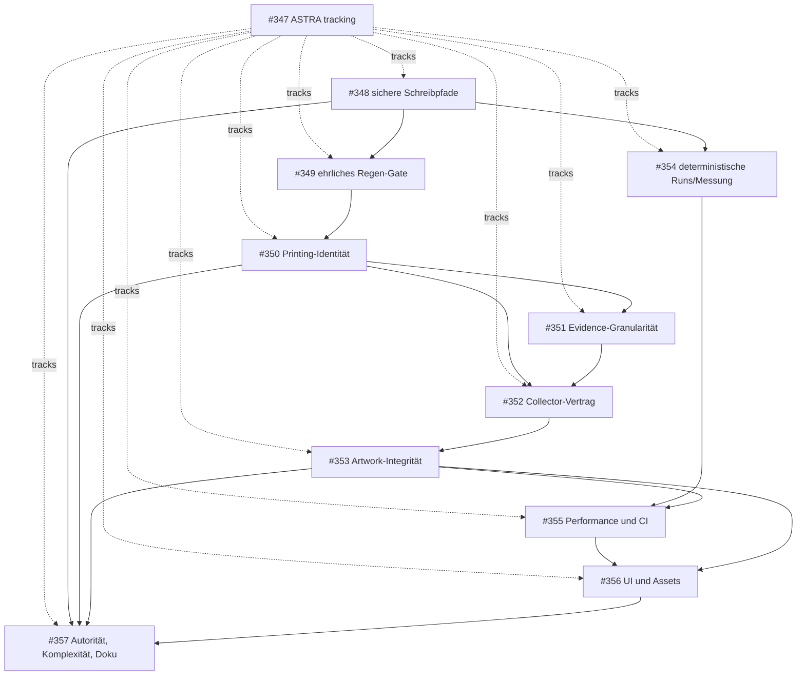

<!-- doc: role=ASTRA remediation execution plan and issue graph; stage=task -->
<!-- graph-dependency
parent: none
depends_on: none
blocks: none (children are tracked below; child-to-child blocking is authoritative)
graph_nodes: ASTRA.md findings -> safe writers/checks -> gate honesty -> identity/evidence contracts -> collector/artwork/workflow -> performance/CI -> authority/docs
-->

# ASTRA remediation plan

Stand: 2026-09-06
Quelle: [ASTRA.md](ASTRA.md), unabhängiger Read-only-Audit auf `origin/main`
Tracking: GitHub-Issue [#347](https://github.com/m4s-ai/snoredex-data/issues/347)

Dieses Dokument plant die Umsetzung der in ASTRA.md reproduzierten Fehler. Es nimmt keine
Implementierung vor. Jede Änderung erfolgt später in einem eigenen, abhängigen GitHub-Issue.

## Ausgangslage und Zielbild

Die fachliche Datenbasis ist weitgehend konsistent, die Probleme liegen an Grenzen zwischen
Evidence, Identität, Generatoren, Prüfmodi, UI und Workflow-Orchestrierung. Die Reparatur soll
folgende Eigenschaften herstellen:

- Ein Check validiert vollständig, bevor er persistente Daten ersetzt, und bleibt ohne explizites
  Schreibflag nebenwirkungsfrei.
- Ein Fehler in einer Teilprüfung wird als Fehler propagiert; kein grüner Gate-Status trotz `[FAIL]`.
- Printing-Identitäten sind in Graph, Collector und Projektionen identisch und unabhängig von der
  Reihenfolge von Markierungen.
- Evidence-Zustände werden strukturiert ausgewertet. Freitext darf keinen fachlichen Status kippen.
- Collector, Tracker und Checklist unterscheiden nachgewiesene Printings, Finish-Kandidaten und
  offene Research-Platzhalter.
- Artwork-Projektionen haben Versionen, die ihren tatsächlichen Inhalt abdecken; Reviews verlieren
  keine Eingaben und melden Speichervorgänge ehrlich.
- Run-Auswahl und Messungen sind deterministisch und erfassen auch bereits geänderte Pfade.
- Discovery-, Test-, DOM- und Asset-Aufwand wird messbar reduziert oder gezielt begrenzt.
- Autorität der Stores und die Dokumentation stimmen mit dem tatsächlich ausgelieferten Verhalten
  überein.

## Baseline, die vor jedem Ticket zu bestätigen ist

Auf einem frischen Checkout von `origin/main` werden mindestens diese Kommandos und Kennzahlen
aufgezeichnet:

```text
python scripts/regen.py --check
python verification/test_site.py
python -m compileall -q scripts verification
```

Audit-Baseline: 55 Regen-Schritte, ca. 330,77 s für den vollständigen Check; davon ca. 103,40 s
Card-Discovery, ca. 147,11 s Findings-Harness und ca. 35,59 s Review-Findings. Die Discovery
verarbeitet 8.761 Run-Dateien (131,88 MiB) mit 1.608 byte-eindeutigen Inhalten (20,95 MiB).
Die Artwork-Seite initialisiert bei 1.440 px 73.348 DOM-Elemente, 8.566 Controls und 559 Review-
Mitglieder; der JSON-Artwork-Block umfasst 2.960.721 Zeichen. Diese Werte sind Messpunkte, keine
neuen Zielwerte ohne Begründung.

## Abhängigkeitsgraph

Die Blockierungsbeziehungen zwischen den Arbeitspaketen sind als GitHub-Graph gesetzt. Das
Tracking-Issue ist nur der Container und blockiert kein Kind. Zusätzlich enthalten die Issues einen
maschinenlesbaren `graph-dependency`-Header.

| Knoten | Arbeitspaket | Issue | Abhängigkeit |
| --- | --- | --- | --- |
| A | Sichere Schreibpfade und read-only Checks | [#348](https://github.com/m4s-ai/snoredex-data/issues/348) | — |
| B | Ehrliches Regen-Gate | [#349](https://github.com/m4s-ai/snoredex-data/issues/349) | #348 |
| C | Printing-Identität | [#350](https://github.com/m4s-ai/snoredex-data/issues/350) | #349 |
| D | Evidence-Granularität | [#351](https://github.com/m4s-ai/snoredex-data/issues/351) | #350 |
| E | Collector-/Tracker-Vertrag | [#352](https://github.com/m4s-ai/snoredex-data/issues/352) | #350, #351 |
| F | Artwork-Integrität | [#353](https://github.com/m4s-ai/snoredex-data/issues/353) | #352 |
| G | Deterministische Runs/Messung | [#354](https://github.com/m4s-ai/snoredex-data/issues/354) | #348 |
| H | Discovery-Performance und CI | [#355](https://github.com/m4s-ai/snoredex-data/issues/355) | #353, #354 |
| I | Artwork-UI und Assets | [#356](https://github.com/m4s-ai/snoredex-data/issues/356) | #353, #355 |
| J | Store-Autorität, Komplexität, Doku | [#357](https://github.com/m4s-ai/snoredex-data/issues/357) | #348, #350, #353, #356 |



## Arbeitspakete

### A — sichere Schreibpfade und wirklich read-only Checks

**ASTRA:** F03, F04, F11.
**Voraussetzungen:** keine.
**Dateibereiche:** `scripts/authoritative_graph.py`, `scripts/database.py`, `scripts/tracker.py`,
`scripts/finishes.py`, `verification/verify_finish_sources.py` sowie die zugehörigen Tests.

**Umsetzung:**

1. Graph-, Datenbank- und Tracker-Checks erst vollständig validieren lassen und anschließend per
   temporärer Datei plus atomarem Replace schreiben.
2. Alte `.check`- und `.check.tmp`-Dateien niemals in einem Read-only-Pfad löschen oder verändern.
3. `finishes.py --check` ohne `--reproject` und `--reproject` mit explizitem Schreibmodus trennen;
   ein Check darf auch bei fehlender Projektion nicht still reparieren.
4. `verify_finish_sources --record` muss bei totalem Netzwerkfehler abbrechen und den vorhandenen
   Fixture unverändert lassen; ein bewusst leerer Datensatz braucht ein eigenes Schreibsignal.

**Akzeptanz:** ungültiger Graph hinterlässt keine persistierte Änderung; Vorher/Nachher-Hashes der
Check-Artefakte bleiben bei allen Check-only Läufen gleich; simulierte Netzwerk-Totalfehler liefern
Exit ungleich 0 und bewahren den Fixture; atomare Writes hinterlassen keine halbfertige Zieldatei.

**Nicht im Scope:** fachliche Evidence-Entscheidungen, neue Quellen, UI-Änderungen.

### B — Regen-Gate muss jeden Fehlerstatus weitergeben

**ASTRA:** F05.
**Voraussetzung:** A.
**Dateibereiche:** `scripts/regen.py`, Gate-/Regenerationstests.

**Umsetzung:**

- Rückgabecode, Zusammenfassung und CI-Text aus einer einzigen Statusaggregation ableiten.
- `[FAIL]` in P6, ein fehlender Schritt oder ein unerwarteter Exception-Status muss das Gate rot
  machen; `p6_only` darf nicht als Erfolg enden.
- Bestehende gezielte Scope-Modi bleiben nutzbar, kennzeichnen aber klar, dass der Voll-Gate noch
  aussteht.

**Akzeptanz:** injizierter P6-Fehler ergibt Exit ungleich 0, keine OK-/green-Behauptung und einen
  reproduzierbaren Test; ein vollständig erfolgreicher Lauf bleibt Exit 0.

**Nicht im Scope:** Laufzeitoptimierung oder das Löschen von Prüfungen.

### C — gemeinsame, reihenfolgeunabhängige Printing-Identität

**ASTRA:** F02.
**Voraussetzung:** B.
**Dateibereiche:** `scripts/authoritative_graph.py`, `scripts/collector_catalogue.py`, gemeinsame
Identitäts-/Normalisierungshelfer und Regressionstests.

**Umsetzung:**

- Eine kanonische Normalisierung für Markierungen definieren und von Graph- und Collector-Pfad
  gemeinsam verwenden.
- Die Identität aus fachlich relevanten, sortierten Komponenten bilden; Eingabereihenfolge darf
  keinen neuen Schlüssel erzeugen.
- Bestehende IDs migrieren oder aliasen, ohne Evidence oder Collection-Eigentum neu zu entscheiden.

**Akzeptanz:** mindestens zwei Permutationen derselben Markierungen liefern bytegleich denselben
  Schlüssel in Graph, Collector und Core; echte Unterschiede bleiben verschieden; bestehende
  veröffentlichte IDs werden geprüft und erhalten.

**Nicht im Scope:** neue Kartenrecherche oder Artwork-Review.

### D — strukturierte Evidence-Granularität

**ASTRA:** F01.
**Voraussetzung:** C.
**Dateibereiche:** `scripts/evidence_semantics.py`, Evidence-Schemas, Statusprojektionen und Tests.

**Umsetzung:**

- `sourceType`, `evidenceKind`/Granularität und Status als getrennte strukturierte Felder behandeln.
- Freitext nur anzeigen oder durchsuchen, nicht als regulären Ausdruck zur Statusentscheidung nutzen.
- Unbekannte oder widersprüchliche Werte explizit als Fehler/Review-Fall melden; fehlende Evidence
  bleibt offen.

**Akzeptanz:** der ASTRA-Fall mit `sourceType`-Text wie „specimen unavailable“ bleibt `needs-evidence`;
  gültige strukturierte positive Evidence wird weiterhin als vorhanden erkannt; Schema- und
  Kompatibilitätstests decken Altbestände ab.

**Nicht im Scope:** fehlende Quellen nachrecherchieren.

### E — Collector-/Tracker-Kompatibilität

**ASTRA:** F06.
**Voraussetzungen:** C und D.
**Dateibereiche:** Collector-Katalog, Checklist-/Tracker-Projektion, Contracts und Tests.

**Umsetzung:**

- Den neuen Collector-Vertrag mit drei Zuständen abbilden: verified printing (737), finish
  candidate (112) und research placeholder (146); Zahlen bei Umsetzung neu messen.
- Marketplace-/Owner-Finish-Kandidaten nicht als bestätigte Printing-Lücke zählen.
- Legacy-Tracker und `analysis_checklist.json` über eine explizite Kompatibilitätsschicht anbinden,
  statt alle 813 dokumentierten Einträge pauschal als „wanted“ zu behandeln.
- Bestehende Recherche-/Owner-Zustände erhalten; keine Entscheidung aus Abwesenheit ableiten.

**Akzeptanz:** jede Projektion kann ihren Zustand und die zugrunde liegende Evidence erklären;
  Legacy-Verbraucher erhalten stabile IDs; Counts und eine kleine Fixture-Matrix werden im Contract
  dokumentiert; Voll-Gate bleibt grün.

**Nicht im Scope:** neue Sprachrecherche (bestehende WEST-Issues bleiben separat).

### F — Artwork-Projektionsversion, Persistenz und stabile Review-Identität

**ASTRA:** F07, F08, F18.
**Voraussetzung:** E.
**Dateibereiche:** Artwork-Generator/Projection, `site/`-Artwork-JavaScript und Tests.

**Umsetzung:**

- `projectionVersion` aus allen inhaltlich relevanten Graph-/Work-Komponenten ableiten; eine
  Änderung des `cardKey` muss die Version ändern.
- Eingaben lokal pro Review-Mitglied aktualisieren, damit ein globales Rerender keine ungespeicherten
  Geschwisterwerte überschreibt.
- Bei blockiertem/fehlgeschlagenem localStorage den Status als nicht gespeichert anzeigen und einen
  erneuten Versuch ermöglichen.
- Stabile geprüfte Artwork-Identität von Evidence-/Bild-Hash-Gruppen trennen; gleicher Hash ist
  kein Beweis für dieselbe Review-Identität.

**Akzeptanz:** Graph-Änderung verändert Version und Cache-Key; Mehrfach-Eingaben überleben Rerender;
  Storage-Fehler melden keinen Erfolg; Fixtures unterscheiden reviewed ID und image/evidence group.

**Nicht im Scope:** vollständige Artwork-Neubewertung oder externe Bildbeschaffung.

### G — deterministische Run-Auswahl und Workflow-Messung

**ASTRA:** F09, F10.
**Voraussetzung:** A.
**Dateibereiche:** `scripts/workflow_loop.py`, Mess-/Pages-Spezifikationen und Tests.

**Umsetzung:**

- Run-Auswahl nach manifestierter fachlicher Reihenfolge, Vollständigkeit und explizitem Run-Status
  treffen; Dateisystem-mtime ist höchstens Diagnoseinformation.
- Messungen mit einem vorherigen Snapshot pro Pfad durchführen, einschließlich bereits dirty Pfade;
  nicht nur `after - before` für neu auftauchende Pfade betrachten.
- Doppelte oder veraltete Pages-Generator-Sequenzen entfernen oder auf eine Quelle zurückführen.

**Akzeptanz:** manipulierte mtimes wählen weiterhin den vollständigen gültigen Run; eine Änderung an
  bereits vorhandenem Pfad wird gemessen; Mess- und Pages-Fixtures sind deterministisch.

**Nicht im Scope:** Performance-Tuning der Parser selbst.

### H — Discovery-Performance und CI-Testgrenzen

**ASTRA:** F13, F16.
**Voraussetzungen:** F und G.
**Dateibereiche:** Discovery-Orchestrierung, `verification/`, CI-Workflow und Performance-Fixtures.

**Umsetzung:**

- Wiederholte Reprojektion der 23 retained runs nur bei verändertem Input oder explizitem Full-
  Refresh ausführen; Cache-Invalidierung muss fachlich nachvollziehbar sein.
- Profiling vor/nachher mit denselben Fixtures dokumentieren; Parser-Aufwand und I/O getrennt messen.
- Findings-Harness in schnelle PR-Fixtures und vollständige Offline-/Release-Prüfung teilen.
- Browser-Abhängigkeiten und Browser-Suite so ausrichten, dass UI-Änderungen im vorgesehenen PR-Gate
  reproduzierbar geprüft werden; reine Daten-PRs bleiben schnell.

**Akzeptanz:** keine stale Projektion bei Input-Änderung; gleiche Outputs bei Cache-Hit und Full-
Refresh; Messprotokoll zeigt Verbesserung ohne Gate-Verlust; CI-Matrix beschreibt jeden Testpfad.

**Nicht im Scope:** fachliche UI-Redesigns.

### I — Artwork-UI- und Asset-Skalierung

**ASTRA:** F14, F15.
**Voraussetzungen:** F und H.
**Dateibereiche:** Artwork-Seite, Datenpartitionierung, Bildderivate und Publish-Konfiguration.

**Umsetzung:**

- Nicht alle 559 Mitglieder und 8.566 Controls initial rendern; Suche/Filter und sichtbare Batches
  sollen die DOM-Größe begrenzen, ohne Tastatur- oder Screenreader-Zugriff zu verlieren.
- Artwork-Daten nach Bedarf laden/partitionieren; JSON-Budget und Ladeverhalten messen.
- Große PNG-Originale unverändert aufbewahren, aber passende Preview-/Thumbnail-Derivate für UI und
  Publish verwenden; Hash-/Attributionsbeziehungen dokumentieren.

**Akzeptanz:** definierte Viewport-/Mitglieds-Fixtures bleiben funktional; DOM, initiale JSON-Menge
  und Bildbytes sinken messbar; Original-Hash und Download-/Attribution-Pfad bleiben verfügbar.

**Nicht im Scope:** Änderung der kuratierten Artwork-Entscheidungen.

### J — Autorität, Komplexität und Dokumentationsabgleich

**ASTRA:** F12, F17, F19.
**Voraussetzungen:** A, C, F und I.
**Dateibereiche:** Store-/Generator-Verträge, betroffene Funktionen mit hoher kognitiver Komplexität,
`CLAUDE.md`, `HANDOVER.md`, `verification/RESUME.md`, Site-/Daten-Dokumentation.

**Umsetzung:**

- Für jeden Store festhalten, ob er kanonische Eingabe, abgeleitete Projektion oder bewusstes
  Materialisierungsartefakt ist; Schreibverantwortung auf einen Generatorpfad konzentrieren.
- Nur bei berührten Funktionen mit nachgewiesener Komplexität vereinfachen; Verhalten und
  Fehlergrenzen zuerst durch Tests sichern. Keine mechanische `_partN`-Zerlegung.
- Dokumentationsverweise, Abschnittsnummern, Counts, Provider-/Owner-/Specimen-Aussagen und die
  öffentliche Claim-Formulierung an den final gemessenen Zustand angleichen.

**Akzeptanz:** ein neuer Entwickler kann Autorität und Erzeugungsreihenfolge aus den Dokumenten
  nachvollziehen; Complexity-Baseline verschlechtert sich nicht; alle Links/Counts sind geprüft;
  vollständiger Regen-Gate und Site-Tests sind grün.

**Nicht im Scope:** neue Datenquellen oder rückwirkende fachliche Behauptungen.

## Gemeinsames Vorgehen pro Issue/PR

1. Branch vom aktuellen `origin/main` erstellen und die ASTRA-Reproduktion als Regressionstest oder
   Fixture festhalten.
2. LOOP PROTOCOL strikt in jeder Agentenrunde verwenden:

   - **PLAN:** genau einen nächsten Schritt und sein Kriterium nennen.
   - **DO:** nur diesen Schritt ausführen.
   - **VERIFY:** relevante Kriterien jeweils 1–10 bewerten, Restschwäche nennen.
   - **DECIDE:** erst bei allen Kriterien mindestens 8/10 `FINAL`; sonst `ITERATING`, schwächste
     Stelle zuerst erneut bearbeiten.

3. Vor jedem Write-Pfad-Change einen Hash-/Backup-Vergleich durchführen; bei Datenmigration eine
   kleine Fixture und den Vollbestand prüfen.
4. Tests zuerst gezielt, danach `python scripts/regen.py --check` als Merge-Gate ausführen. Ein
   gezielter grüner Lauf darf keinen vollständigen Gate ersetzen.
5. PR beschreibt Problem, Verhaltensänderung, Tests und verbleibende Risiken. Issue erst schließen,
   wenn Akzeptanz und Dokumentation erfüllt sind.

## Definition of Done für das Tracking-Issue

- Alle zehn Kinder-Issues sind in Graph-Reihenfolge geschlossen oder mit einer begründeten,
  reproduzierbaren Blockade dokumentiert.
- Jede ASTRA-Feststellung ist entweder durch einen Test/Vertrag behoben oder als bewusst akzeptierte
  Restentscheidung mit Evidence vermerkt.
- `python scripts/regen.py --check`, Site-Tests, betroffene Browser-/Daten-Fixtures und
  `compileall` sind auf dem finalen Commit erfolgreich.
- Keine unbeabsichtigten Änderungen an Evidence, IDs, Owner-/Collection-Entscheidungen oder
  Original-Assets.
- ASTRA.md bleibt der Auditbefund; dieses Dokument und die Repository-Dokumentation beschreiben den
  danach geltenden Zustand.
