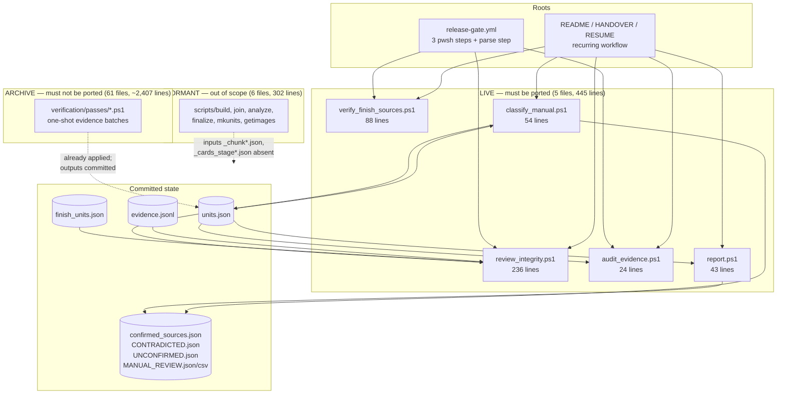
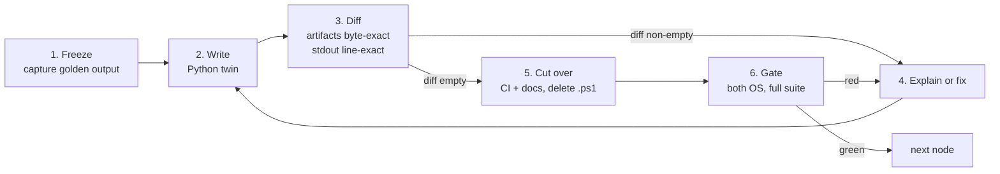

# Consolidating the toolchain on Python — plan

Status: **plan only.** No migration work has been done. Nothing in this document has been
executed; it exists to be argued with before any code moves.

## Objective

Remove PowerShell as a *runtime* dependency of this repository, so that a clean clone needs one
language interpreter instead of two, and so that a rule about the data has one place to live
instead of two.

The objective is deliberately not "translate every `.ps1` file". Those are different goals, and
the second one is mostly waste — see [What must not be ported](#what-must-not-be-ported).

## 1. The graph

The repository is modelled as a directed graph. Nodes are scripts, data artifacts, CI steps and
documents. Edges are of four kinds:

| Edge | Meaning |
| --- | --- |
| `invokes` | a CI step or a documented command runs a script |
| `reads` | a script consumes a committed artifact |
| `writes` | a script produces a committed artifact |
| `polices` | a gate check asserts a property *of the scripts themselves* |

A node needs porting if and only if it is reachable from a **root** — a CI step, or a command
the project documents as part of the recurring workflow. Everything else is a leaf that nothing
traverses, and translating it changes nothing about how the repository runs.

### Roots

- `.github/workflows/release-gate.yml` — three `pwsh -File` steps plus one `shell: pwsh` step
  that parses every `.ps1` file, on both `ubuntu-latest` and `windows-latest`
- The recurring workflow documented in `README.md`, `HANDOVER.md`, `verification/RESUME.md`,
  `verification/FINISH_SOURCES.md` and `verification/passes/README.md`

### Reachability partition



The partition is not an opinion. `verification/passes/README.md` already states that the passes
are "the one-shot record of completed evidence batches … not part of the recurring release
toolchain and are not expected to be rerun", and that the `scripts/` pipeline is "also historical
for now" because its stage inputs are not in the repository.

**The cut set is 5 nodes and 445 lines — 14% of the PowerShell in the tree.** The other 86% is
record, not code that runs.

## 2. What the overhead actually is

Worth being precise, because "reduce overhead" should name the overhead it removes.

1. **Two interpreters in CI, on two operating systems.** Four `pwsh` steps per job, in a
   2-job matrix. One of them — "Parse every PowerShell file" — exists *solely* because `.ps1`
   files exist; it buys nothing once they do not.
2. **Two check harnesses over the same data.** `review_integrity.ps1` carries 22 structural
   invariants and 7 drift metrics; `verification/review_findings.py` carries 66 checks and
   documents itself as complementing the former. A new rule about the data requires choosing a
   harness, and a reader asking "what is enforced?" must read both.
3. **PowerShell-specific policy in the Python gate.** Checks `X3` ("Active PowerShell writers
   use UTF-8 without BOM") and `X4` ("PowerShell path portability is not bypassed through direct
   System.IO calls") exist only to police PowerShell. `X5` (no BOM in tracked text) and the
   `utf-8-sig` readers in `scripts/site.py` and elsewhere are scar tissue from PowerShell 5.1
   emitting BOMs. Removing the producer lets some of this retire.
4. **An implicit portability dependency.** The live scripts build paths as `"$B\verification"`
   and work on Linux only because PowerShell's filesystem provider normalises `\`. That is an
   unstated assumption sitting under a green CI job, and it is adjacent to open issue #28.
5. **A contributor-facing split.** `CONTRIBUTING.md` documents Python commands only. PowerShell
   is a prerequisite that only maintainers discover, and only from `HANDOVER.md`.

The direction is already established: `verification/passes/` contains two Python passes
(`audit_bulbapedia_release_dates.py`, `normalize_collector_numbers.py`), and every generator,
the publication gate, the browser suite and the findings harness are Python. This plan finishes a
migration that has been happening informally.

## 3. What must not be ported

**The 61 archived passes.** They are the audit trail of how the committed evidence came to be. A
translated pass is not the script that produced the record — it is a new script that claims to
be. For a repository whose entire premise is that every claim is auditable back to a source, that
is a real loss for zero runtime gain. They stay, byte for byte.

**The 6 dormant pipeline scripts.** `_chunk1-3.json` and `_cards_stage1-3.json` are not in the
repository, so these cannot be run, tested, or differentially verified by anyone today. Porting
them would produce untested code whose only proof of correctness is that it looks like the
original. Reviving ingestion is issue #28 and is a *data-access* decision — Cardmarket is
deliberately rate-limited — not a translation task. If #28 revives the pipeline, it should be
written in Python then, against real inputs.

## 4. Waves

Ordered topologically by artifact coupling and by how hard the node is to prove equivalent.
Read-only nodes first, because a wrong port cannot corrupt state; writers next, where the proof
is byte-exact; the network-dependent node last, because its input is not deterministic.

### Wave 0 — build the harness (no ports)

Deliver `verification/passes/../_parity/` (working name): a differential runner that executes a
`.ps1` and its Python twin against the same inputs in separate temporary trees, then compares
written artifacts byte for byte and normalised stdout line for line. Without this, every later
wave is an assertion instead of a measurement. Also record a golden capture of current stdout
from all five live scripts, on both operating systems, before anything changes.

**Exit:** the runner reports "identical" for all five scripts compared against *themselves*
(a null test that proves the harness measures what it claims).

### Wave 1 — read-only checkers → Python

`audit_evidence.ps1` (24 lines), then `review_integrity.ps1` (236 lines). These are what CI
actually runs. Neither mutates canonical state, so the failure mode of a bad port is a wrong
verdict, caught by the golden capture.

`review_integrity.ps1` is the one node where a 1:1 translation is the wrong shape — see
[Consolidation decision](#5-consolidation-decision).

**Exit:** the two Python entry points reproduce every check name, verdict and drift metric of the
originals against current `main`, in the same order; CI runs Python; the `.ps1` files are deleted
in the same commit that cuts CI over, so there is never a window with two enforcers.

### Wave 2 — writers → Python

`report.ps1` (43 lines) and `classify_manual.ps1` (54 lines). These write
`confirmed_sources.json`, `CONTRADICTED.json`, `UNCONFIRMED.json`, `MANUAL_REVIEW.json`,
`MANUAL_REVIEW.csv`, and `classify_manual.ps1` rewrites `units.json` in place.

The proof obligation here is stronger and also easier to state: **running the Python twin on
committed inputs must leave `git status` clean.** `ConvertTo-Json` formatting, key order, date
formatting (`Get-Date -Format s`) and CSV quoting all have to match, or the artifacts churn.
Expect this to be the fiddly wave; budget accordingly.

**Exit:** byte-identical artifacts, `git diff --exit-code` clean after a full run of both scripts.

### Wave 3 — the networked checker → Python

`verify_finish_sources.ps1` (88 lines) calls TCGCSV live and is Linux-only in CI. Port it with a
recorded-response fixture so the *logic* is testable offline, keeping the live call as the CI
path. This is also an opportunity to converge on one HTTP idiom, since the Python side already
has caching conventions.

**Exit:** identical failure/pass verdicts against recorded fixtures and against a live run.

### Wave 4 — decommission

- Delete the "Parse every PowerShell file" CI step.
- Re-scope or retire `X3` and `X4` in `review_findings.py`; if the archive stays under
  `verification/passes/`, `X3`/`X4` should be re-pointed at it or replaced by a single check that
  the archive is unmodified. Keep `X5` — BOM-free text is worth enforcing regardless of producer.
- Move the archive to a location that says what it is (`verification/archive/passes/`), with a
  README stating the never-rerun policy. This is the only change to archived files: their path.
- Update `README.md`, `HANDOVER.md`, `verification/RESUME.md`, `verification/FINISH_SOURCES.md`,
  `verification/passes/README.md`, `CONTRIBUTING.md` and the `verification/*.ps1` glob in
  `LICENSE.md`.
- Decide whether the Windows matrix leg stays. **It should** — it now proves the *Python* code is
  path-portable, which is the assumption issue #28 is about.

**Exit:** `find . -name '*.ps1' -not -path './verification/archive/*'` is empty; no `pwsh` in any
workflow; both gate jobs green.

## 5. Consolidation decision

Translating `review_integrity.ps1` into a standalone `review_integrity.py` would move the
duplication rather than remove it: two harnesses, two output formats, two places to add a rule.

The recommendation is to fold its 22 invariants into the existing `check()` harness in
`review_findings.py`, extracting the shared parts (artifact loading, the check/report protocol,
the exit-code contract) into a small module both entry points import. Two CI steps remain, so a
failure still names which family broke, but there is one implementation of "how a check is
declared and reported".

One semantic must survive the merge intact: `review_integrity.ps1` deliberately **reports** count
drift instead of failing on it, and fails only when a count moves *backwards*. The file explains
why — a gate that goes red when the project makes progress is a gate people learn to bypass.
That behaviour is a design decision, not an implementation detail, and porting it faithfully
matters more than tidying it.

## 6. The conversion loop

Every node in the cut set goes through the same closed loop. The loop has an explicit error
signal, so "done" is measured rather than declared.



Rules that make the loop terminate rather than wander:

- **One node per commit.** Rollback is `git revert` of a single commit, not an archaeology
  session.
- **The diff is the exit condition, not a code review.** If the diff is non-empty, either the port
  is wrong or the difference is intentional and gets written into this document's exception list.
  There is no third outcome.
- **No parallel enforcement.** The `.ps1` is deleted in the same commit that points CI at the
  Python. A window where both run is a window where they can disagree silently.
- **The outer loop is the gate.** A node is not done when its diff is empty; it is done when both
  matrix jobs are green with the `.ps1` gone.

## 7. Invariants

Hold at every commit, not merely at the end:

- **I1 — single enforcer.** For each check family, exactly one implementation is invoked by CI.
- **I2 — artifact stability.** Committed artifacts are byte-identical before and after each
  cut-over. The generators' existing `--check` passes plus `git diff --exit-code` prove it.
- **I3 — the archive is immutable.** Archived passes change path at most; never content.
- **I4 — no verdict regression.** Every check name that exists before a wave exists after it, with
  the same verdict on current `main`.

## 8. Termination criteria

Machine-checkable, so completion is not a judgement call:

```
find . -name '*.ps1' -not -path './verification/archive/*' -not -path './.git/*'   # empty
grep -rn 'pwsh' .github/workflows/                                                # no matches
git diff --exit-code                                                              # clean after a full toolchain run
```

plus both gate jobs green, `verification/test_site.py` at its current count, and
`review_findings.py` reporting no fewer checks than before.

## 9. Effort

| Wave | Scope | Rough size |
| --- | --- | --- |
| 0 | Differential harness + golden captures | ~150 lines, half a session |
| 1 | `audit_evidence` + `review_integrity` → consolidated harness | ~300 lines, the bulk of one session |
| 2 | `report` + `classify_manual`, byte-exact | ~200 lines, plus formatting-parity fiddle |
| 3 | `verify_finish_sources` + fixtures | ~150 lines |
| 4 | CI, gate checks, docs, archive move | small diffs across ~8 files |

Total new Python is on the order of 800 lines replacing 445 lines of PowerShell — porting is not
compression, and the harness and fixtures are new capability rather than translated code.

## 10. Open decisions

These need an owner's answer before Wave 1, because they change the shape of the work:

1. **Consolidate or translate?** Fold `review_integrity` into the `review_findings` harness
   (recommended), or keep a standalone `review_integrity.py` mirroring the original file for
   file-level diffability against history?
2. **Archive location.** Move to `verification/archive/passes/` (recommended — the path then
   states the policy), or leave the passes where they are and adjust `X3`/`X4` instead?
3. **The dormant `scripts/` pipeline.** Archive it alongside the passes (recommended), or hold it
   in place pending issue #28?
4. **Windows matrix leg.** Keep (recommended, it now tests Python path portability) or drop for
   CI minutes?
