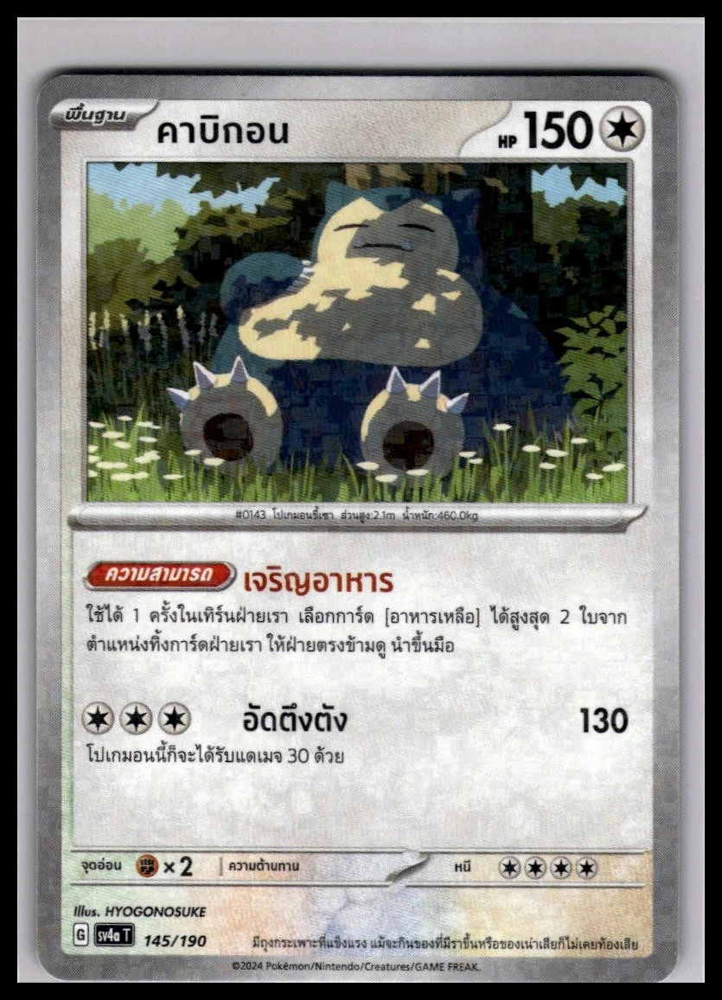

<!-- doc: role=retained Thai research before implementation; stage=history -->
# Recherche zu Issue #262 – Thai-Beleglücken

Historical record — Recherchestand vor der anschließenden Umsetzung.

Die folgende Recherche beschreibt den Stand vor der Umsetzung. Die anschließend beauftragten Änderungen und den neuen Stand 13/28 dokumentiert [IMPLEMENTATION.md](IMPLEMENTATION.md).

Stand: 15.09.2026 (Europe/Berlin). Abrufe erfolgten am 14.09.2026 UTC; die einzelnen Zeitstempel stehen in den Capture-Dateien.

## Ergebnis und Aktualität

[Issue #262](https://github.com/m4s-ai/snoredex-data/issues/262) bleibt berechtigt und sollte offen bleiben. Sein Text ist teilweise veraltet: [PR #375](https://github.com/m4s-ai/snoredex-data/pull/375) wurde bereits am 11.09.2026 gemergt. Die darin erwarteten 10/28 lückenfreien Veröffentlichungen sind im aktuellen Katalog jedoch nicht erreicht.

Geprüfter Main-Stand: `2c1818c01f299d5f085721145a9d05e3f7dfebeb`. Katalog-Fingerprint: `sha256:936f442e94eb44d4ab9b37249d14605bc69f3e8fe43d6ba2b6c5132fdf0b14f3`.

| Kennzahl | Aktueller Befund |
| --- | --- |
| Thai-Veröffentlichungen | 28, verteilt auf 33 aktive Katalogeinträge |
| Ohne erfasste Lücke | **8/28** |
| Mit mindestens einer Lücke | **20/28** |
| Ohne bestätigte physische Ausführung | **18**: 14 ohne Kandidat, 4 mit unbelegtem Kandidat |
| Fehlendes Erscheinungsdatum | **2** |
| Fehlende Seltenheit | **1**, zusätzlich zur Finish-Lücke bei MA6 T 121/130 |
| Fehlende Nummer, lokale Set-Identität oder Bildzuordnung | **0** |

Zehn Veröffentlichungen haben bereits eine bestätigte physische Ausführung. Zwei davon, s5a T 093/070 und s10a T 077/071, bleiben allein wegen ihres fehlenden Datums offen. Der Titel „8/28“ stimmt damit noch, seine frühere Begründung und die Darstellung als ausstehender PR nicht. Die Detailzählung steht in [catalogue-audit.json](catalogue-audit.json). Die 29 referenzierten Thai-Bilddateien waren vorhanden und entsprachen ihren gespeicherten SHA-256-Werten.

## Fünf konkrete Ansatzpunkte

### 1. s5a T 093/070: offizielles Datum 30.04.2021

Die [offizielle thailändische Produktsuche](https://asia.pokemon-card.com/th/card-search/?pageNo=4) ordnet dem Produkt „สองยอดนักสู้“ den Veröffentlichungstermin **04-30-2021** zu. Die [offizielle S5a-Produktseite](https://asia.pokemon-card.com/th/archive/special/card/s5af/index.html) unterstützt die Produktidentität; sie ist für sich genommen kein Datumsbeleg.

Der physische Beleg SPEC-0523 ist bereits vorhanden. Der neue lokale Datensatz wurde in `verification/passes/reconcile_pr375_photo_identifiers.py` mit `releaseDate: None` angelegt. Das Datum muss mit dem offiziellen Produktbeleg der richtigen lokalen Ausgabe zugeordnet werden; eine erneute Fotoanforderung löst diese Lücke nicht.

Retained source: `raw/official-s5a-date.html`, ergänzend `raw/official-s5a-page.html`.

### 2. s10a T 077/071: offizielles Datum 29.07.2022

Die [offizielle Thai-Ankündigung zu Dark Phantasma](https://asia.pokemon-card.com/th/archives/1596/) nennt **29. Juli 2565**, entsprechend **29.07.2022**. SPEC-0520 belegt bereits die lokale Karte und ihre physische Ausführung. Hier fehlt ebenfalls die Übernahme des separat belegten Produktdatums.

Die allgemeine Mirror-Aussage auf dieser Produktseite belegt keine bestimmte Finish-Ausführung von Snorlax 058/071. Diese andere Karte bleibt separat offen.

Retained source: `raw/official-s10a-date.text.txt`.

### 3. SV-P 082/SV-P: vorhandener Non-Holo-Beleg wird nicht zugeordnet

[Pokumon](https://pokumon.com/card/snorlax-082-sv-p-thai-promo/) nennt die konkrete Thai-Promo ausdrücklich als **Non-holo** und beschreibt die Central-Pattana-Verteilung. Die Quelle ist bereits als `pokumon-th-svp082` registriert; ein bestätigter Non-Holo-Override existiert in `verification/finish_overrides.json`.

Die Zuordnung scheitert an unterschiedlichen Nummern: Der Override verwendet `082/SV-P`, die generierte Finish-Einheit F0460 dagegen `082`. `scripts/finishes.py` sucht Overrides über das exakte Tupel aus Set und Nummer. Deshalb bleibt die zugehörige Printing-Liste leer.

Empfehlung: diese konkrete Identität gezielt abgleichen und die resultierende Katalogausgabe prüfen. Keine pauschale Kürzung aller Promonummern. Zusätzlich den Stempeltext korrigieren bzw. prüfen: Auf dem erhaltenen Bild steht **CENTRAL PATTANA**; der Veranstaltungsname „The Great Celebration 2024“ ist nicht automatisch der aufgedruckte Wortlaut.

Das erhaltene PNG ist eine saubere Kartenabbildung, kein geeigneter fotografischer Non-Holo-Nachweis. Die Finish-Aussage beruht auf dem expliziten Text der bereits registrierten Fachquelle, nicht auf fehlendem Glanz im Bild.

Retained sources: `raw/pokumon-promo082.text.txt`, `promo082-pokumon.png`.

### 4. sv4a T 145/190: neuer Reverse-Foil-Bildbeleg

Das [eBay-Angebot 297969171577](https://www.ebay.com/itm/297969171577) enthält ein erhaltenes Vorderseitenfoto mit lesbarer Thai-Schrift, `sv4a T`, `145/190`, HP150 und HYOGONOSUKE. Reflexionen im Text- und unteren Kartenbereich außerhalb der Illustration unterstützen eine **Reverse-/Mirror-Foil-Ausführung**.

Die strukturierten Angebotsfelder widersprechen dem Foto: „Japanese“ und „Normal“. Diese Felder werden nicht als Belege übernommen. Maßgeblich ist das konkrete Bild. Ein exakter Folienmustername, vollständige Variantenabdeckung und Maße sind dadurch nicht bewiesen.

Vorschlag: als neuen Specimen-Beleg aufnehmen und gegen den bestehenden Reverse-Holo-Kandidaten prüfen. Die ebenfalls gesicherte Rückseite zeigt keine eigenständige Thai-Identität; ihre Verbindung ergibt sich nur aus derselben Angebotsgalerie.

### 5. sc3b T 126/158: neuer Holo-Bildbeleg

Ein [Shopee-Angebot von Hitcard7350](https://shopee.co.th/product/431199770/23151999066) ist mit der exakten Nummer und Foil indexiert. Das originale CDN-Bild ließ sich sichern und visuell prüfen: Thai-Schrift, `sc3b T`, `126/158 R`, HP130 und Anesaki Nishida sind erkennbar. Farbige Reflexionen im Illustrationsbereich unterstützen **Holo**.

Es handelt sich um einen mit Wasserzeichen versehenen Produkt-Scan/Freisteller, nicht um eine unbeschnittene Aufnahme aus mehreren Winkeln. Die Händlerlogos sind keine Kartenstempel. Das Produkt selbst war nicht direkt abrufbar; die Zuordnung des CDN-Bildes stammt aus dem indexierten Angebot. Diese Einschränkung ist bei einer Aufnahme als Beleg mitzunehmen.

Ein [weiteres eBay-Angebot](https://www.ebay.it/itm/168654792697) nennt dieselbe Thai-Karte als Foil Holo. Seine Originalfotos konnten nicht abgerufen werden; es bleibt ein ergänzender Suchhinweis und kein zweiter Bildnachweis.

## Vollständige Arbeitsliste der 20 offenen Veröffentlichungen

„Kein neuer Bildbeleg“ bedeutet ausschließlich, dass diese Recherche keinen ausreichend geprüften Treffer lieferte. Es ist kein Nachweis, dass eine Ausführung nicht existiert.

| Karte | Aktuelle Lücke | Ergebnis / nächster Ansatz |
| --- | --- | --- |
| sc1a T 127/154 | Finish, kein Kandidat | Kein neuer geeigneter physischer Bildbeleg |
| sc1b T 119/153 | Finish, kein Kandidat | [Thai-Shop-Treffer](https://shopee.co.th/product/19819669/5685794295); Foto noch ungeprüft |
| sc1b T 120/153 | Finish, kein Kandidat | [Thai-Shop-Treffer](https://shopee.co.th/product/19819669/7970582025); Foto noch ungeprüft |
| sc1D T 132/164 | Finish, kein Kandidat | Offizielle Identitätsabbildung ist kein Finish-Beleg |
| sc1D T 133/164 | Finish, kein Kandidat | Kein neuer geeigneter physischer Bildbeleg |
| sc3b T 126/158 | Finish, kein Kandidat | Neuer Holo-Scan, siehe oben |
| scA T 084/135 | Finish, kein Kandidat | Kein neuer geeigneter physischer Bildbeleg |
| SH 026/038 | Finish, kein Kandidat | Deck-Beschreibungen belegen nicht das Finish dieser Einzelkarte |
| s8b 126/184 | Reverse-Holo-Kandidat | [Exakter Thai-R/Foil-Treffer](https://shopee.co.th/product/34894051/12382671946); Originalfoto noch ungeprüft |
| scD T 111/159 | Finish, kein Kandidat | Kein neuer geeigneter physischer Bildbeleg |
| s10b 056/071 | Non-Holo-Kandidat | [Thai-Shop-Treffer](https://shopee.co.th/product/412643607/25102563945); Seltenheit R allein belegt kein Finish |
| s10a 058/071 | Non-Holo-/Reverse-Holo-Kandidaten | Offizielle allgemeine Mirror-Ankündigung reicht nicht für diese Karte |
| SV-P 082/SV-P | Finish, kein Kandidat | Vorhandenen Non-Holo-Override korrekt zuordnen; Stempelwortlaut prüfen |
| sv4a 145/190 | Reverse-Holo-Kandidat | Neues physisches Reverse-Foil-Foto, siehe oben |
| sv4a 310/190 | Finish, kein Kandidat | [Thai-Shiny-Foil-Treffer](https://shopee.co.th/product/1416820789/27231339385); Originalfoto noch ungeprüft |
| svM 094/175 | Finish, kein Kandidat | Japanische Angebote nicht auf die Thai-Ausgabe übertragen |
| MA4 091/123 | Finish, kein Kandidat | Shop-Klassifikation C ist kein Finish-Beleg |
| MA6 T 121/130 | Finish und Seltenheit | [Offiziell für 16.09.2026 angekündigt](https://asia.pokemon-card.com/th/archive/special/card/ma6/); am Recherchetag noch zukünftig. Render belegt keine physische Ausführung |
| s10a T 077/071 | Datum | Offiziell 29.07.2022 belegt |
| s5a T 093/070 | Datum | Offiziell 30.04.2021 belegt |

## Empfohlene Überarbeitung des Issues

1. PR #375 als gemergt markieren; aktuellen Commit und Katalog-Fingerprint angeben. Stand weiterhin 8/28 lückenfrei, jetzt mit 18 Finish-Fällen und zwei separat belegbaren Datumslücken.
2. Die beiden Produktdaten und den bestehenden Promo-Override als konkrete Übernahme-/Zuordnungsarbeiten führen, nicht weiter als fehlende externe Recherche.
3. Die zwei neuen Verkäuferbilder durch den bestehenden Specimen- und Claim-Prozess prüfen. Erst danach die betroffenen Finish-Kandidaten als bestätigt ausweisen.
4. Die weiteren indexierten Angebote als Suchhinweise behandeln. MA6 nach dem angekündigten Erscheinungstermin auf reale Kartenbilder und lesbare Seltenheit prüfen.

## Methode, Grenzen und Dateien

Dies ist eine lokale Recherche, keine kanonische Aufnahme und keine Änderung des GitHub-Issues. Es wurden keine Karten-, Claim-, Specimen- oder Katalogdaten geändert. Neue Bilder besitzen deshalb bewusst noch keine SPEC-IDs. Hermes ist für diese Arbeit nicht relevant.

Der Audit gruppiert aktive Thai-Katalogeinträge nach `cardReleaseId`. Eine bestätigte physische Ausführung genügt für den entsprechenden Veröffentlichungsstatus; das behauptet keine vollständige Kenntnis aller Varianten. Identität, Datum, Seltenheit und Finish werden getrennt beurteilt. „mapped-by-explicit-equivalence“ gilt als vorhandene Werkzuordnung; ein fehlender normalisierter Seltenheitscode allein ist keine Lücke, wenn die quelleneigene Seltenheit vorhanden ist.

Die offiziellen HTML-Seiten und Pokumon wurden direkt abgerufen und lokal erhalten. Bilder wurden visuell geprüft, ohne OCR. Suchmaschinen-Bildbeschreibungen wurden nicht als Karteninhalt übernommen. Shop-Treffer mit japanischen Bildern oder widersprüchlicher Lokalität wurden nicht übertragen. Ojama-Abrufe scheiterten an TLS-Hostname-Prüfung, einzelne eBay-/Shopee-Seiten an Abrufbeschränkungen; Zertifikatsprüfungen wurden nicht umgangen.

- `issue-snapshot.json`: gelesener Issue-Stand einschließlich Kommentaren.
- `catalogue-audit.json`: reproduzierbarer Bezug auf die geprüften Veröffentlichungen und Lücken.
- `page-captures.json`: erfolgreiche Abrufe mit Zeitstempel, Dateipfad, SHA-256 und dokumentierte Abruffehler.
- `image-captures.json`: vier Bilddateien mit Herkunft, Abrufzeit, SHA-256 und feldbezogener visueller Bewertung.
- `raw/`: erhaltene Quellen-HTMLs und gekennzeichnete Textauszüge ohne Webseiten-Skripte; Originalantworten zu den Auszügen bleiben lokal im ignorierten Cache. Eine manuelle Quellenaufnahme wird nicht als automatisierter Adapterlauf ausgegeben.

Vor einer kanonischen Übernahme sind die jeweiligen Quellenfähigkeiten und die genaue lokale Kartenidentität im bestehenden Prüfablauf zu berücksichtigen. Insbesondere Verkäuferbilder sind hier neue Belegvorschläge, keine bereits akzeptierten Bestätigungen.
